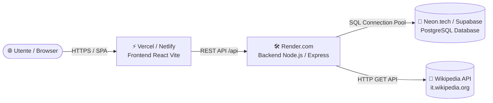

# 🚀 Guida al Deployment Gratuito — RoadToUnina

Questa guida descrive la procedura completa, trasparente e passo-passo per pubblicare l'intera applicazione **RoadToUnina** (Frontend React + Backend Express + Database PostgreSQL) online su piattaforme **100% Gratuite (Zero Costi)** ad alte prestazioni.

---

## 🏗️ Architettura di Deployment



| Componente | Piattaforma Gratuita Consigliata | Caratteristiche |
| :--- | :--- | :--- |
| **Frontend** | [Vercel](https://vercel.com) / [Netlify](https://netlify.com) | CDN globale, HTTPS automatico, SPA rewrite nativo |
| **Backend** | [Render.com](https://render.com) / [Fly.io](https://fly.io) | Container Node.js 20 LTS, HTTPS, auto-deploy da Git |
| **Database** | [Neon.tech](https://neon.tech) / [Supabase](https://supabase.com) | PostgreSQL 16 serverless, connection pooling integrato |

---

## 📋 STEP 1: Creazione Database PostgreSQL Gratuito (Neon / Supabase)

1. Registrati gratuitamente su **[Neon.tech](https://neon.tech)** o **[Supabase](https://supabase.com)**.
2. Crea un nuovo progetto (es. `roadtounina-prod`) selezionando la regione europea più vicina (es. `Frankfurt` o `Ireland`).
3. Copia la stringa di connessione **Postgres Connection URI** fornita dalla dashboard. Il formato è:
   ```env
   postgresql://<user>:<password>@<host>/<database>?sslmode=require
   ```
   > 💡 *Consiglio:* Su Neon, seleziona l'opzione "Pooled connection" per ottimizzare l'uso delle connessioni concorrenti.

---

## 🛠️ STEP 2: Deployment Backend su Render.com

1. Registrati o accedi a **[Render.com](https://render.com)**.
2. Clicca su **New +** e seleziona **Web Service**.
3. Collega il tuo repository GitHub/GitLab contenente il progetto `RoadToUnina`.
4. Configura i parametri del servizio:
   - **Name**: `roadtounina-backend`
   - **Root Directory**: `backend`
   - **Environment**: `Node`
   - **Region**: `Frankfurt (EU Central)`
   - **Branch**: `main`
   - **Build Command**:
     ```bash
     npm ci && npx prisma generate && npm run build
     ```
   - **Start Command**:
     ```bash
     npm run start
     ```
   - **Instance Type**: `Free`

5. Nella sezione **Environment Variables**, aggiungi le seguenti chiavi:
   | Nome Variabile | Valore di Esempio | Descrizione |
   | :--- | :--- | :--- |
   | `NODE_ENV` | `production` | Modalità produzione per Express |
   | `PORT` | `3001` (o assegnato da Render) | Porta di ascolto del server HTTP |
   | `DATABASE_URL` | `postgresql://...` | Connection string PostgreSQL da Step 1 |
   | `JWT_SECRET` | `unina_secret_key_prod_2026_speedrun!` | Chiave segreta per firma token JWT |
   | `ALLOWED_ORIGINS` | `https://roadtounina.vercel.app,http://localhost:5173` | Domini autorizzati CORS (aggiorna con URL Vercel) |

6. Clicca su **Create Web Service**. Al termine della build, copia l'URL pubblico del backend (es. `https://roadtounina-backend.onrender.com`).

---

## 🌱 STEP 3: Esecuzione Migrazioni e Database Seeding in Produzione

Per applicare lo schema Prisma e popolare il database con le partite di esempio e gli utenti simulati:

### Opzione A: Tramite la Render Shell (Dashboard)
1. Vai nella scheda del servizio su Render e clicca su **Shell**.
2. Esegui il comando di migrazione e seeding:
   ```bash
   npx prisma migrate deploy
   npx prisma db seed
   ```

### Opzione B: Dal proprio terminale locale (usando DATABASE_URL remoto)
```bash
cd backend
DATABASE_URL="<TUA_STRINGA_NEON_PRODUZIONE>" npx prisma migrate deploy
DATABASE_URL="<TUA_STRINGA_NEON_PRODUZIONE>" npx prisma db seed
```

---

## ⚡ STEP 4: Deployment Frontend su Vercel

1. Accedi a **[Vercel](https://vercel.com)** e clicca su **Add New... > Project**.
2. Importa il repository `RoadToUnina`.
3. Configura le impostazioni di build:
   - **Framework Preset**: `Vite`
   - **Root Directory**: `frontend`
   - **Build Command**: `npm run build`
   - **Output Directory**: `dist`
   - **Install Command**: `npm ci`
4. Nella sezione **Environment Variables**, aggiungi:
   | Nome Variabile | Valore |
   | :--- | :--- |
   | `VITE_API_BASE_URL` | `https://roadtounina-backend.onrender.com/api` |
5. Clicca su **Deploy**.
6. Vercel assegnerà un dominio HTTPS (es. `https://roadtounina.vercel.app`).
7. Torna su Render.com e assicurati che la variabile `ALLOWED_ORIGINS` del backend contenga l'URL Vercel generato.

> 📄 **Nota sulle rotte SPA:** Il file [`frontend/vercel.json`](file:///Users/lucabarrella/Documents/RoadToUnina/frontend/vercel.json) include già la regola di rewrite `/* -> /index.html` per garantire il corretto funzionamento di React Router su `/game`, `/leaderboard`, `/login`, ecc.

---

## 🐳 STEP 5 (Alternativa): Deployment Docker Locale o su VPS

Se preferisci avviare l'intero stack (Frontend + Backend + PostgreSQL) tramite Docker:

```bash
# 1. Clona il repository ed entra nella cartella
cd RoadToUnina

# 2. Avvia tutti i servizi in background
docker compose up --build -d

# 3. Applica il seeding iniziale nel container backend
docker compose exec backend npx prisma migrate deploy
docker compose exec backend npx prisma db seed
```

- **Frontend**: `http://localhost:5173`
- **Backend API**: `http://localhost:3001`
- **PostgreSQL**: `localhost:5432`

---

## ✅ Checklist di Verifica Post-Deployment

- [ ] **Health Check API**: Verifica che `https://<backend-url>/api/public/leaderboard` restituisca lo status 200 con la classifica JSON.
- [ ] **Accesso Frontend**: Naviga su `https://<frontend-url>` e verifica il caricamento della grafica Neo-Brutalist.
- [ ] **Registrazione & Login**: Registra un nuovo account da `https://<frontend-url>/register`.
- [ ] **Partita Speedrun**: Avvia una speedrun e completa il percorso fino all'articolo obiettivo.
- [ ] **Classifica**: Controlla la visualizzazione del podio su `/leaderboard`.
