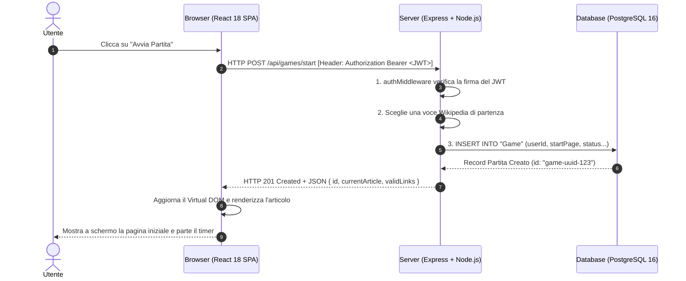

# 📘 Modulo 1: Dallo Zero Assoluto a TypeScript & Architettura Web

> **Candidato:** Luca Barrella (`N86004677`)  
> **Progetto:** RoadToUnina (Wikipedia Speedrun)  
> **Obiettivo:** Costruire le fondamenta teoriche e pratiche partendo da zero per capire ogni singola riga della codebase.

---

## 1. Come Funziona il Web Moderno in Parole Semplici

Quando giochi a RoadToUnina dal browser, ci sono **due computer distinti che comunicano continuamente attraverso Internet**:

1. **Il Client (Frontend / Browser):** È il tuo laptop o smartphone. Il suo unico compito è mostrare la grafica (pulsanti, testo enciclopedico, HUD di gioco) e ascoltare i tuoi click.
2. **Il Server (Backend):** È un computer sempre attivo nel cloud (su Render.com) che riceve i messaggi del client, verifica la legittimità delle azioni, interroga il database PostgreSQL (su Supabase) e restituisce risposte in formato JSON.



---

## 2. Il Protocollo HTTP e le API REST

Tutta la comunicazione avviene tramite il protocollo **HTTP (HyperText Transfer Protocol)**.

### I Verbi HTTP Principali
- **`GET`**: Usato esclusivamente per *leggere o richiedere* dati senza alterare lo stato del database.  
  *Esempio:* `GET /api/public/leaderboard` (dammi la classifica) o `GET /api/games/active` (dimmi se ho una partita aperta).
- **`POST`**: Usato per *inviare dati* per creare nuove risorse o compiere azioni di gioco.  
  *Esempio:* `POST /api/games/start` (crea una nuova partita) o `POST /api/games/:id/step` (invia il click sul link).

### Gli Status Code (Codici di Risposta) da Sapere all'Orale
Il server risponde sempre con un codice numerico a 3 cifre:
- **`200 OK`**: Operazione riuscita (es. classifica restituita, passo effettuato con successo).
- **`201 Created`**: Nuova risorsa creata (es. nuova partita registrata su DB).
- **`400 Bad Request`**: Il client ha inviato dati non validi (es. formato sbagliato o link non presente nella voce di Wikipedia).
- **`401 Unauthorized`**: Token JWT assente, scaduto o manomesso.
- **`404 Not Found`**: Risorsa non trovata (es. l'ID della partita non esiste nel DB).
- **`409 Conflict`**: Conflitto di concorrenza (**Optimistic Concurrency Control** - doppio click troppo rapido).
- **`500 Internal Server Error`**: Errore imprevisto sul server.

---

## 3. Cos'è TypeScript e Perché lo Usiamo

JavaScript puro è un linguaggio a **tipizzazione debole e dinamica**:
```javascript
// In JavaScript normale (fonte di bug catastrofici):
let punteggio = 10;
punteggio = "dieci"; // JavaScript lo accetta senza batter ciglio!
punteggio.toFixed(2); // CRASH a runtime in produzione: toFixed non è una funzione per stringhe!
```

**TypeScript** aggiunge un sistema di **tipi statici**: i tipi vengono verificati *mentre scrivi il codice*, prima ancora di mandarlo in esecuzione.

### A. I Tipi Primitivi
```typescript
const username: string = "lucabarrella";
const clicksCount: number = 4;
const isFinished: boolean = false;
```

### B. Le Interfacce (`interface`) e i Tipi (`type`)
Definiscono la "forma" esatta che un oggetto deve avere:
```typescript
export interface WikiArticleResponse {
  title: string;        // Il titolo dell'articolo
  htmlContent: string;  // Il contenuto HTML pulito da mostrare
  validLinks: string[]; // Array di titoli dei soli link enciclopedici cliccabili
}
```
Se provassi a scrivere `article.autore`, il compilatore TypeScript si bloccherebbe subito dicendo:  
*“Errore: la proprietà 'autore' non esiste sul tipo 'WikiArticleResponse'”*.

### C. Asincronia Moderna: `Promise`, `async` e `await`
Chiamare il database o Wikipedia richiede tempo (da 10ms a 200ms). In JavaScript non si blocca mai il thread principale. Si usano le **Promise**:
```typescript
// La parola 'async' indica che la funzione compie operazioni asincrone
async function getGameById(id: string): Promise<Game | null> {
  // 'await' dice a Node: "Fai la query a Postgres. Nel frattempo servi altri utenti!
  // Appena Postgres risponde, riprendi da qui con il risultato".
  const game = await prisma.game.findUnique({ where: { id } });
  return game;
}
```

---

## 4. L'Autenticazione Stateless con Token JWT

Invece di salvare le sessioni nel database del server (che occuperebbero memoria e limiterebbero la scalabilità), RoadToUnina usa **JSON Web Tokens (JWT)**:

```
eyJhbGciOiJIUzI1NiIsInR5cCI6IkpXVCJ9.eyJ1c2VySWQiOiIxMjMiLCJ1c2VybmFtZSI6Imx1Y2EifQ.s7D9fW...
[------------ HEADER -------------] . [------------- PAYLOAD -------------] . [--- FIRMA ---]
```

1. **Login:** Invii email e password a `POST /api/auth/login`.
2. **Emissione:** Il server verifica la password cifrata con `bcrypt`. Se corretta, crea un token contenente `{ userId, username }` e lo firma crittograficamente con la chiave segreta `JWT_SECRET`.
3. **Utilizzo:** Il browser memorizza questo token e lo invia a ogni richiesta nell'header HTTP:  
   `Authorization: Bearer <token_jwt>`
4. **Verifica:** Il server decodifica e verifica la firma matematicamente. Se valida, sa immediatamente chi sei senza bisogno di fare query al database per la sessione!
