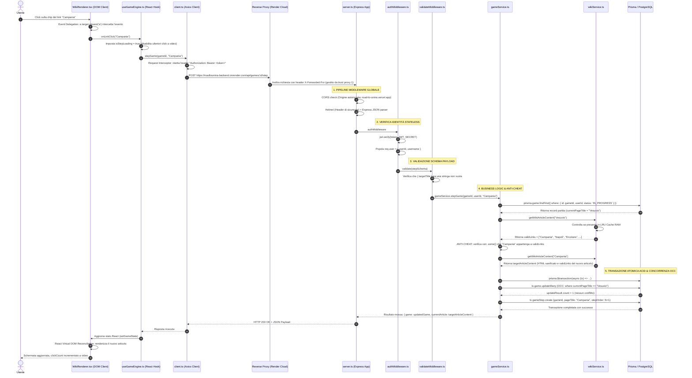

# 🏛️ Modulo 2: Architettura a 3 Livelli, Cloud Deployment e Flusso Dati

> **Candidato:** Luca Barrella (`N86004677`)  
> **Progetto:** RoadToUnina (Wikipedia Speedrun)  
> **Obiettivo:** Conoscere con precisione chirurgica la topologia a 3 livelli, l'infrastruttura reale su Vercel, Render e Supabase, e il ciclo di vita dettagliato di ogni chiamata HTTP.

---

## 1. La Topologia a 3 Livelli (3-Tier Architecture)

L'applicazione separa rigorosamente la presentazione grafica, la logica applicativa e la persistenza dei dati:

```mermaid
graph TD
    subgraph Tier1["1. PRESENTATION TIER (Client / Browser)"]
        React["React 18 Single Page Application (SPA)<br/>• Bundler: Vite<br/>• Styling: Tailwind CSS<br/>• Cloud Host: Vercel CDN Globale<br/>• Dominio: https://road-to-unina.vercel.app"]
    end

    subgraph Tier2["2. APPLICATION TIER (Server / Business Logic)"]
        Express["Node.js + Express 5 + TypeScript<br/>• Specifica & Docs: OpenAPI 3.0 + Swagger UI (/api/docs)<br/>• Validazione: Zod Schemas runtime<br/>• Codegen: openapi-typescript per tipi client sincronizzati<br/>• Autenticazione: Stateless JWT (HS256)<br/>• Cache: In-Memory LRU (200 voci, max 50MB)<br/>• Cloud Host: Render.com Web Service<br/>• Dominio: https://roadtounina-backend.onrender.com/api"]
    end

    subgraph Tier3["3. DATA TIER (Storage Relazionale)"]
        Postgres["PostgreSQL 16 Gestito<br/>• ORM: Prisma Client con Driver Adapter (@prisma/adapter-pg)<br/>• Pooling: pg.Pool (max 10 connessioni) + PgBouncer<br/>• Cloud Host: Supabase (AWS Region eu-north-1 Stoccolma)<br/>• Porta: 6543 (Transazioni su PgBouncer) / 5432 (Sessioni)"]
    end

    subgraph External["SERVIZIO ESTERNO"]
        Wiki["Wikimedia REST API (Wikipedia Italia)<br/>• Endpoint: /api/rest_v1/page/html/{title}<br/>• User-Agent identificativo obbligatorio<br/>• Formato: HTML pulito (Namespace 0)"]
    end

    React <-->|HTTPS REST API (JSON) - Contratti OpenAPI 3.0 (openapi-typescript)<br/>Header: Authorization Bearer JWT| Express
    Express <-->|HTTPS GET / Chiamate Esterne| Wiki
    Express <-->|TCP TLS Connessione Poolata (Prisma)| Postgres
```

---

## 2. Dettaglio dell'Infrastruttura Cloud in Produzione

| Parametro | Presentation Tier (Frontend) | Application Tier (Backend) | Data Tier (Database) |
| :--- | :--- | :--- | :--- |
| **Piattaforma Cloud** | **Vercel** | **Render.com** | **Supabase** |
| **Tipologia Hosting** | Serverless Edge CDN Globale | Web Service Containerizzato (Linux) | Managed PostgreSQL Cloud (AWS) |
| **URL Ufficiale** | `https://road-to-unina.vercel.app` | `https://roadtounina-backend.onrender.com` | `aws-0-eu-north-1.pooler.supabase.com` |
| **Runtime / Motore** | Static HTML5 + JS Bundle (Vite) | Node.js 20 LTS Runtime | PostgreSQL 16.1 Engine |
| **Routing SPA / API** | Riscritte `/* -> /index.html` via `vercel.json` | Express Router modulare (`/api/...`) | Schema relazionale `public` con Prisma |
| **Variabili Ambiente** | `VITE_API_BASE_URL` | `DATABASE_URL`, `DIRECT_URL`, `JWT_SECRET`, `ALLOWED_ORIGINS` | Credenziali di connessione cifrate SSL |

---

## 3. Il Viaggio Completo di una Richiesta: Il Click sul Link

Ecco il tracciamento cronologico e architetturale di cosa avviene tra il click dell'utente e la persistenza a database, allineato fedelmente al codice sorgente reale:



---

## 4. Proprietà Ingegneristiche Chiave dell'Architettura

### A. Architettura Disaccoppiata (Decoupled & Headless)
Il backend espone esclusivamente un set di endpoint REST in formato JSON. Non genera frammenti HTML server-side.
- **Vantaggio:** Il backend è completamente agnostico rispetto al consumer. Può servire contemporaneamente la SPA React su Vercel, una futura applicazione mobile (React Native / Flutter) o una CLI senza richiedere modifiche alla logica.

### B. Statelessness & Orizzontalità (JWT)
Il backend non conserva sessioni utente nella memoria centrale dell'istanza Node.js.
- L'identità del client è interamente contenuta nel token crittografico **JWT**.
- Qualsiasi istanza del backend può elaborare una qualsiasi richiesta HTTP semplicemente verificando la firma crittografica con `JWT_SECRET`.
- Questo consente a piattaforme cloud come Render di scalare il servizio da 1 a $N$ container orizzontalmente senza richiedere sessioni appiccicose (*Sticky Sessions*).

### C. Connessione Ibrida e Pooling (Prisma + pg.Pool + PgBouncer)
Poiché le connessioni TCP verso PostgreSQL remoto (Supabase) sono costose in termini di latenza di handshake SSL e risorse di memoria sul DB:
- In [`backend/src/config/db.ts`](file:///Users/lucabarrella/Documents/RoadToUnina/backend/src/config/db.ts), l'istanza singleton di Prisma utilizza `@prisma/adapter-pg` collegata a una `Pool` di `node-postgres` (`pg.Pool`).
- La pool locale mantiene fino a un massimo di 10 connessioni persistenti aperte e riutilizzabili.
- A livello infrastrutturale, la stringa di connessione punta alla porta `6543` di Supabase, presidiata da **PgBouncer** in modalità *Transaction Pooling*, garantendo saturazione zero anche sotto picchi di traffico simultaneo.
