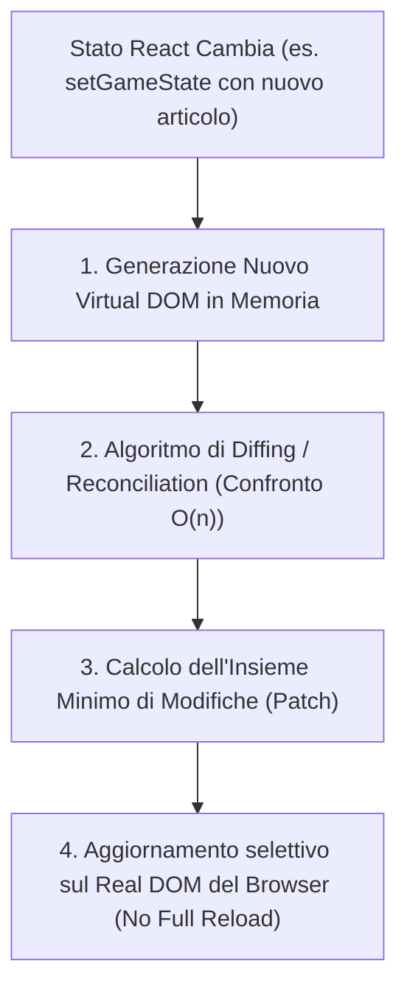

# 🖥️ Modulo 4: Guida Approfondita al Frontend (React 18, Hooks, Event Delegation & UI)

> **Candidato:** Luca Barrella (`N86004677`)  
> **Progetto:** RoadToUnina (Wikipedia Speedrun)  
> **Obiettivo:** Padroneggiare la Presentation Tier, l'architettura SPA, il ciclo di vita del Virtual DOM, gli Hooks personalizzati, l'Event Delegation e la sanitizzazione XSS con DOMPurify.

---

## 1. Mappa Strutturale del Frontend (`frontend/src/`)

```
frontend/src/
├── api/
│   └── client.ts              # Istanza centralizzata Axios con Request & Response Interceptors
├── components/
│   ├── game/
│   │   ├── HUDBar.tsx         # Barra di stato superiore (timer, titolo corrente, click, resa)
│   │   └── WikiRenderer.tsx   # Rendering articolo Wikipedia, Event Delegation e DOMPurify
│   ├── layout/
│   │   ├── Navbar.tsx         # Barra di navigazione responsive con badge utente e logout
│   │   └── Footer.tsx         # Footer con crediti e matricola accademica
│   └── ui/
│       ├── Button.tsx         # Componente pulsante Neo-Brutalist con stati loading/disabled
│       ├── Card.tsx           # Container box con bordo netto 2px e shadow marcata
│       └── Toast.tsx          # Notifiche push temporanee per errori o avvisi
├── hooks/
│   ├── useAuth.tsx            # Context & Hook per login, registrazione, logout e persistenza token
│   ├── useGameEngine.ts       # Motore di gioco: cronometro locale, mossa step, modale vittoria
│   └── useLeaderboard.ts      # Hook di fetch e cache per la classifica globale
├── pages/
│   ├── GamePage.tsx           # Schermata principale: canvas di gioco, HUD e sidebar storico passi
│   ├── LeaderboardPage.tsx    # Pagina classifica pubblica con podio top-3
│   ├── LoginPage.tsx          # Form di accesso con validazione client e messaggi d'errore
│   ├── RegisterPage.tsx       # Form di registrazione nuovo account
│   └── NotFoundPage.tsx       # Pagina 404 per route non esistenti
├── types/
│   ├── index.ts               # Contratti TypeScript condivisi (User, Game, GameStep, WikiArticle)
│   └── api.generated.ts       # Tipi TypeScript compilati automaticamente da OpenAPI 3.0 via openapi-typescript
├── App.tsx                    # Albero delle route (react-router-dom) e AuthProvider wrapper
├── index.css                  # Direttive Tailwind CSS e stili custom Neo-Brutalist
└── main.tsx                   # Entry point React: createRoot(document.getElementById('root'))
```

---

## 2. Come Funziona React 18: Virtual DOM & Reconciliation

In una classica applicazione web anni 2000, ogni click richiede al server una nuova pagina HTML completa (con sfarfallio bianco e ricaricamento totale della pagina).  
In RoadToUnina usiamo **React 18 SPA (Single Page Application)**:



### Perché è fondamentale all'esame:
- **Zero Sfarfallio:** Il browser aggiorna solo i nodi modificati (ad esempio solo il testo del paragrafo o il contatore click nell'HUD).
- **Evita Reflow & Repaint Pesanti:** Ricalcolare il layout grafico di un intero documento HTML è l'operazione più costosa per un browser. Il Virtual DOM riduce queste operazioni al minimo indispensabile.

---

## 3. Il Componente Chiave: `WikiRenderer.tsx` & Event Delegation

Una voce Wikipedia (es. *"Napoli"* o *"Campania"*) contiene centinaia di link `<a>`.  
Se provassimo ad agganciare una funzione React `onClick={() => handleStep()}` su ciascun singolo link:
- Creeremmo centinaia di listener in memoria RAM per ogni pagina.
- Le performance crollerebbero su dispositivi mobili.

### La Soluzione Ingegneristica: **Event Delegation**
Agganciamo **un solo event listener** sul `<div>` genitore che avvolge l'intero articolo:

```tsx
// frontend/src/components/game/WikiRenderer.tsx
const handleContentClick = (event: React.MouseEvent<HTMLDivElement>) => {
  // Sfrutta l'Event Bubbling: risale l'albero del DOM dall'elemento cliccato fino al tag <a>
  const anchor = (event.target as HTMLElement).closest('a');

  // Se l'utente ha cliccato su testo normale o immagini non linkate, ignora
  if (!anchor) return;

  // Blocca la navigazione naturale del browser verso https://it.wikipedia.org
  event.preventDefault();

  const title = anchor.getAttribute('data-wiki-title') || anchor.getAttribute('title');
  if (title && onLinkClick) {
    onLinkClick(title); // Inoltra la mossa al motore di gioco
  }
};

return (
  <div 
    className="wiki-content prose max-w-none" 
    onClick={handleContentClick} // <-- UNICO EVENT LISTENER IN MEMORIA!
    dangerouslySetInnerHTML={{ __html: sanitizedContent }} 
  />
);
```

### Perché fa felice il professore:
1. **Memoria costante $O(1)$:** Un solo gestore di eventi per l'intero documento anziché $O(N)$ gestori per ogni link.
2. **Sfrutta l'Event Bubbling nativo del browser:** Gli eventi scatenati sui nodi figli risalgono automaticamente verso i padri.

---

## 4. Difesa contro XSS (Cross-Site Scripting): Defense-in-Depth

Quando si inietta HTML dinamico con `dangerouslySetInnerHTML`, si rischia l'esecuzione di script JavaScript malevoli (**XSS**).  
In RoadToUnina applichiamo la strategia di sicurezza **Defense-in-Depth (Difesa su Più Livelli)**:

```
Wikipedia REST API (HTML originale con script e stili)
        │
        ▼
[ LIVELLO 1: Server-side ]  -> wikiService.ts usa 'sanitize-html' (Whitelist tag e attributi)
        │
        ▼
[ Rete HTTPS / JSON ]       -> Viaggia solo HTML filtrato
        │
        ▼
[ LIVELLO 2: Client-side ]  -> WikiRenderer.tsx applica DOMPurify.sanitize() prima del render
        │
        ▼
Inserimento nel DOM reale del browser (Sicurezza al 100%)
```

Codice in `WikiRenderer.tsx`:
```typescript
import DOMPurify from 'dompurify';

// Sanificazione client-side immediata prima di passare l'HTML al DOM
const sanitizedContent = useMemo(() => {
  return DOMPurify.sanitize(htmlContent, {
    ADD_TAGS: ['a', 'span', 'p', 'h1', 'h2', 'h3', 'table', 'tr', 'td', 'ul', 'li'],
    ADD_ATTR: ['data-wiki-title', 'class', 'href'],
  });
}, [htmlContent]);
```

---

## 5. Gestione dello Stato e Hooks Personalizzati

### A. Il Motore di Gioco: `useGameEngine.ts`
Incapsula tutta la macchina a stati del gameplay:
- **Timer in tempo reale:** Gestito con `setInterval` all'interno di un `useEffect`, con funzione di cleanup `clearInterval` per evitare memory leak quando il componente viene smontato.
- **Transizioni di stato atomiche:** Gestisce il passaggio tra `STARTING`, `IN_PROGRESS`, `VICTORY` e `FORFEIT`.
- **Prevenzione doppio click:** Attiva un flag booleano `isStepLoading` che disabilita temporaneamente i puntatori del mouse durante la risoluzione della richiesta HTTP.

### B. Il Client API Centralizzato: `api/client.ts`
Configura un'istanza singleton di **Axios**:
- **Request Interceptor:** Prima che qualsiasi richiesta parta, preleva il token JWT dal `localStorage` e inietta automaticamente l'header `Authorization: Bearer <token>`.
- **Response Interceptor:** Se il backend risponde con `401 Unauthorized` (token scaduto o non valido), intercetta l'evento ed esegue il logout automatico reindirizzando alla schermata di login.
