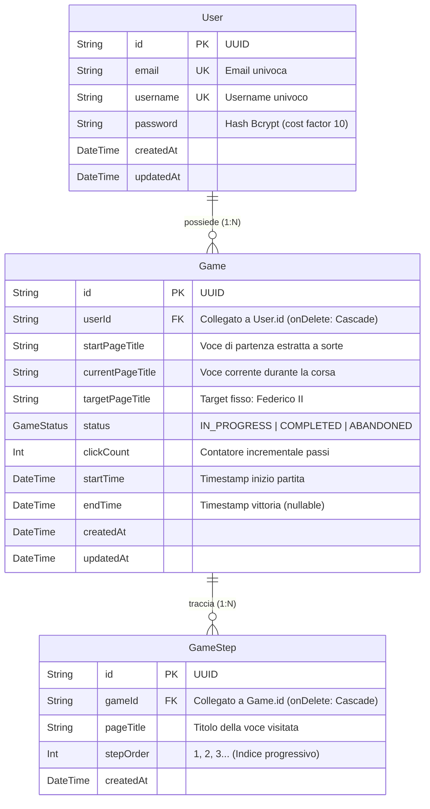

# 🗄️ Modulo 5: Database PostgreSQL, Prisma ORM & Sicurezza Web

> **Candidato:** Luca Barrella (`N86004677`)  
> **Progetto:** RoadToUnina (Wikipedia Speedrun)  
> **Obiettivo:** Padroneggiare il Data Tier, lo schema relazionale Prisma, il Connection Pooling con PgBouncer e le difese contro le minacce web (SQL Injection, IDOR, Bcrypt, CORS).

---

## 1. Lo Schema Relazionale (`backend/prisma/schema.prisma`)

Il database relazionale PostgreSQL si basa su tre entità strettamente collegate con vincoli di integrità referenziale:



### Indici e Vincoli Ingegneristici Spiegati al Professore:
1. **`@@index([userId, status])` su `Game`:**  
   Consente al backend di eseguire in tempo $O(\log N)$ la query per trovare la partita attiva di un utente (`findFirst where userId AND status = 'IN_PROGRESS'`). Senza questo indice composito, Postgres dovrebbe eseguire un costoso *Full Table Scan* scansionando tutte le righe della tabella.
2. **`@@unique([gameId, stepOrder])` su `GameStep`:**  
   Vincolo di unicità composito a livello di motore database. Rende fisicamente impossibile salvare due passi con lo stesso numero d'ordine per una singola partita, scongiurando corruzione dati anche sotto attacchi di concorrenza estremi.
3. **`onDelete: Cascade`:**  
   Garantisce l'integrità referenziale. Se un utente o una partita viene eliminata, tutte le righe figlie associate (`GameStep`) vengono cancellate a cascata dal motore relazionale senza lasciare record orfani.

---

## 2. Il Connection Pooling: `pg.Pool` & PgBouncer

### Il Problema Reale:
Aprire una connessione TCP verso un database remoto cloud comporta:
- Handshake TCP a 3 vie.
- Negoziazione TLS/SSL per cifrare i dati in transito.
- Autenticazione e allocazione di memoria sul processo PostgreSQL server.
Questo processo impiega tra i **50 e i 150 millisecondi** per ogni singola query!

### La Soluzione Adottata (`backend/src/config/db.ts`):
```typescript
import { Pool } from 'pg';
import { PrismaPg } from '@prisma/adapter-pg';
import { PrismaClient } from '@prisma/client';

const pool = new Pool({
  connectionString: process.env.DATABASE_URL,
  max: parseInt(process.env.DB_POOL_MAX || '10', 10), // Max 10 connessioni riutilizzabili
  idleTimeoutMillis: 30000,
  connectionTimeoutMillis: 10000,
});

const adapter = new PrismaPg(pool);
export const prisma = new PrismaClient({ adapter });
```

- **In locale/Node:** Manteniamo un pool persistente di connessioni sempre aperte. Quando una richiesta deve fare una query, "prende in prestito" una connessione libera dal pool e la restituisce appena terminata l'operazione.
- **Nel Cloud (Supabase):** Ci colleghiamo alla porta `6543` presidiata da **PgBouncer** (*Transaction Mode*), che permette a centinaia di richieste web concorrenti di condividere una manciata di processi database reali.

---

## 3. Le Difese di Sicurezza Web Implementate

### A. Prevenzione SQL Injection (Zero Vulnerabilità)
- **Come funziona l'attacco:** Un utente invia input come `' OR '1'='1` per forzare l'autenticazione o estrarre dati.
- **Nostra difesa:** Usiamo **Prisma ORM** con **Prepared Statements parametrizzati**. Nessuna query viene mai assemblata concatenando stringhe. I parametri vengono inviati al motore database separatamente dal piano di esecuzione SQL.

### B. Protezione IDOR (Insecure Direct Object Reference)
- **Come funziona l'attacco:** L'attaccante conosce l'ID di una partita altrui (`gameId = "abc"`) e invia una chiamata per farla fallire o compiere un passo al posto dell'altra persona.
- **Nostra difesa:** Tutte le query di modifica e lettura incrociano sempre l'ID risorsa con l'identità verificata estratta dal token JWT:
  ```typescript
  // gameService.ts
  where: {
    id: gameId,
    userId: userId, // <-- IMPOSSIBILE alterare le partite di altri utenti!
    status: GameStatus.IN_PROGRESS,
  }
  ```

### C. Hashing delle Password: Bcrypt vs SHA-256
Se il professore chiede: *"Perché non avete usato semplicemente un hash SHA-256 o MD5?"*

| Caratteristica | SHA-256 (Non idoneo per password) | Bcrypt (Adottato in RoadToUnina) |
| :--- | :--- | :--- |
| **Velocità** | Estremamente veloce (miliardi di tentativi/sec su GPU) | Deliberatamente lento (~80ms per hash) |
| **Protezione Brute-Force** | Vulnerabile ad attacchi massivi con dizionario | Computazionalmente impraticabile da attaccare |
| **Salt (Sale Crittografico)** | Assente di base (vulnerabile a Rainbow Tables) | Generato e integrato automaticamente per ogni password |
| **Fattore di Costo** | Fisso | Configurabile esponenzialmente (`cost factor = 10`) |

Codice reale in `backend/src/services/authService.ts`:
```typescript
const BCRYPT_SALT_ROUNDS = 10;
const hashedPassword = await bcrypt.hash(password, BCRYPT_SALT_ROUNDS);
```
