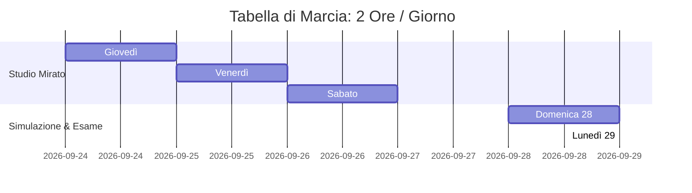

# 🎯 Piano Operativo di Studio — Esame di Tecnologie Web (RoadToUnina)
**Candidato:** Luca Barrella (`N86004677`)  
**Docente:** Prof. Luigi Libero Lucio Starace, Ph.D. — DIETI, Università degli Studi di Napoli Federico II  
**Strategia:** 4 Giorni $\times$ 2 Ore al Giorno = **8 Ore Totali** per blindare la discussione e puntare al **30 e Lode**.

---

## 🏆 1. La Strategia del Voto: Perché puntare al 30
La valutazione finale è calcolata come media pesata:
$$\text{Voto Finale} = (0.60 \times \text{Scritto}) + (0.40 \times \text{Progetto})$$

* Se al progetto prendi **30/30L**, tiri su la media dello scritto di **+2 o +3 punti**!
* Tutto ciò che studi sul codice in queste 8 ore copre **direttamente argomenti dello scritto** (HTTP status, REST, JWT, CORS, XSS, Event Delegation, Virtual DOM, SQL injection).
* Non devi scrivere nuovo codice: il progetto è **100% finito, testato (58 Vitest + 19 Playwright) e già deployato online**.

---

## 📅 2. Cronoprogramma: 2 Ore al Giorno (2 Slot da 50 min + 10 min pausa)



---

### 🟢 GIOVEDÌ — Giorno 1: Frontend & Il Giro delle Chiamate (2h)
> **Obiettivo:** Sapere esattamente cosa fa il browser e padroneggiare la domanda trabocchetto sui link di Wikipedia.

* **Slot 1 (50 min) — Prova pratica con Network Tab (F12):**
  1. Apri l'app live ([road-to-unina.vercel.app](https://road-to-unina.vercel.app)) o in locale.
  2. Apri i DevTools (tasto `F12` $\rightarrow$ scheda **Network** con filtro su `Fetch/XHR`).
  3. Esegui il login, avvia una partita, fai 2 click su un link e osserva il JSON:
     - `POST /api/auth/login` $\rightarrow$ ricevi il token JWT nell'oggetto JSON.
     - `POST /api/games/start` $\rightarrow$ ricevi `{ id, startPageTitle, currentArticle: { htmlContent, validLinks } }`.
     - `POST /api/games/:id/step` con payload `{ targetTitle: "..." }` $\rightarrow$ ricevi la pagina aggiornata.
* *[Pausa 10 min]*
* **Slot 2 (50 min) — Analisi di `WikiRenderer.tsx`:**
  - Apri [`frontend/src/components/game/WikiRenderer.tsx`](file:///Users/lucabarrella/Documents/RoadToUnina/frontend/src/components/game/WikiRenderer.tsx#L288-L298).
  - **La Domanda Chiave:** *"Come gestisci il click sui link di Wikipedia se il testo arriva in blocco dal server?"*
  - **La Risposta d'Oro:** **Event Delegation**. Non aggiungiamo `onClick` React su ogni singolo tag `<a>` (ce ne sono centinaia e saturerebbero la memoria). Agganciamo un unico event listener sul container genitore che intercetta i click risalendo il DOM con `e.target.closest('a')`.
  - **Defense-in-Depth:** Nota come l'HTML viene sanificato sia con `sanitize-html` sul server, sia con `DOMPurify.sanitize` prima di essere iniettato a schermo.

---

### 🔵 VENERDÌ — Giorno 2: Backend Core, Anti-Cheat & Concorrenza (2h)
> **Obiettivo:** Padroneggiare il cuore computazionale dell'app dove il prof farà le domande più tecniche.

* **Slot 1 (50 min) — Analisi di `gameService.ts`:**
  - Apri [`backend/src/services/gameService.ts`](file:///Users/lucabarrella/Documents/RoadToUnina/backend/src/services/gameService.ts).
  - **Anti-Cheat (Zero-Trust Client)** ([righe L178-L184](file:///Users/lucabarrella/Documents/RoadToUnina/backend/src/services/gameService.ts#L178-L184)):
    - Quando l'utente manda `/step`, il backend interroga `wikiService` per la pagina corrente.
    - Controlla con `.some()` che `targetTitle` appartenga ai link validi della pagina memorizzata a DB. Se l'utente invia una richiesta artefatta (es. via Postman o curl) per saltare alla Federico II, riceve `400 INVALID_STEP`.
  - **Concorrenza Atomica (OCC)** ([righe L192-L210](file:///Users/lucabarrella/Documents/RoadToUnina/backend/src/services/gameService.ts#L192-L210)):
    - Per evitare race condition se l'utente clicca due volte velocemente, usiamo l'**Optimistic Concurrency Control**: la query `updateMany` filtra per `id`, `userId` e `currentPageTitle: game.currentPageTitle`.
    - Se due click arrivano insieme, il primo aggiorna il titolo; il secondo trova `count === 0` e restituisce in modo pulito `409 Conflict`.
* *[Pausa 10 min]*
* **Slot 2 (50 min) — Analisi di `wikiService.ts` e `authMiddleware.ts`:**
  - Apri [`backend/src/services/wikiService.ts`](file:///Users/lucabarrella/Documents/RoadToUnina/backend/src/services/wikiService.ts):
    - Estrae solo i link del **Namespace 0** (voci enciclopediche principali), scartando Categorie, Portali, Pagine di Discussione e Modifica.
    - Usa una **LRU Cache (Least Recently Used)** in RAM limitata a 200 voci e 50MB per non farsi bannare dalle API di Wikimedia.
  - Apri [`backend/src/middlewares/authMiddleware.ts`](file:///Users/lucabarrella/Documents/RoadToUnina/backend/src/middlewares/authMiddleware.ts):
    - Estrae l'header `Authorization: Bearer <token>`, ne verifica la firma con `jwt.verify(token, JWT_SECRET)` e allega il payload decodificato a `req.user`.

---

### 🟡 SABATO — Giorno 3: Database, Sicurezza & Test Suite (2h)
> **Obiettivo:** Mostrare padronanza di Postgres e saper dimostrare l'affidabilità con la suite di test.

* **Slot 1 (50 min) — Database & Schema Prisma:**
  - Apri [`backend/prisma/schema.prisma`](file:///Users/lucabarrella/Documents/RoadToUnina/backend/prisma/schema.prisma):
    - `User`: credenziali cifrate con **Bcrypt** (cost factor 10, slow hashing contro attacchi dizionario/rainbow table).
    - `Game`: stato (`IN_PROGRESS`, `COMPLETED`, `ABANDONED`), data inizio, fine, contatore click. Indice `@@index([userId, status])` per trovare la partita attiva istantaneamente.
    - `GameStep`: storico passi con `@@unique([gameId, stepOrder])` che impedisce passi duplicati e `onDelete: Cascade` per l'integrità referenziale.
  - **Protezione IDOR:** Spiega che tutte le query di modifica includono `where: { id: gameId, userId }`, impedendo a un utente di alterare partite altrui.
* *[Pausa 10 min]*
* **Slot 2 (50 min) — La Suite di Test (Vitest):**
  - Esegui nel terminale: `cd backend && npm test`.
  - Osserva i **58 test verdi** che passano in ~30 secondi.
  - Apri [`backend/src/__tests__/breakBackend.test.ts`](file:///Users/lucabarrella/Documents/RoadToUnina/backend/src/__tests__/breakBackend.test.ts):
    - Test di stress con **20 click simultanei** per escludere deadlock.
    - Test di resilienza con stringhe da 500 caratteri, emoji e tentativi di SQL Injection.

---

### 🟣 DOMENICA 28 — Giorno 4: Simulazione Orale & Setup Demo (2h)
> **Obiettivo:** Vincere l'ansia da prestazione ripetendo a voce alta le risposte pronte.

* **Slot 1 (50 min) — Le 5 Domande Trabocchetto:**
  - Apri [`GUIDA_ESAME_ORALE.md`](file:///Users/lucabarrella/Documents/RoadToUnina/GUIDA_ESAME_ORALE.md#L260-L278) (Sezione 5) e ripeti a voce alta:
    1. *"Perché usate JWT stateless invece delle sessioni su database?"*
    2. *"Come gestite la concorrenza tra richieste simultanee?"*
    3. *"Cosa succede se un utente chiude il browser e torna dopo 3 giorni?"* (Timeout 24h, stato impostato ad `ABANDONED`).
    4. *"Come prevenite attacchi XSS dai contenuti di Wikipedia?"*
    5. *"Perché avete usato il connection pooling di Postgres?"*
* *[Pausa 10 min]*
* **Slot 2 (50 min) — Prova Generale della Demo:**
  - Cronometra **3 minuti** di presentazione fluida del progetto:
    1. *Titolo & Traccia:* RoadToUnina, speedrun enciclopedico verso la Federico II.
    2. *Demo interattiva:* Login, inizio partita, navigazione su 2 o 3 chip `.wiki-chip`, arrivo/abbandono e visualizzazione classifica con podio.
    3. *Setup Laptop:* Chrome con 3 tab già aperte (App demo, Leaderboard, VS Code posizionato su `gameService.ts`).

---

## 🛡️ 3. Il "Metodo in 3 Passi" per spiegare qualsiasi riga di codice
Se il docente apre un file a sorpresa e punta il dito su una riga qualsiasi, mantieni la calma e usa questa formula fissa:

```
[Passo 1: Cosa fa tecnicamente]
"Questa riga è una chiamata asincrona tramite Prisma / Express / Axios che..."

[Passo 2: Perché serve all'applicazione]
"...serve per verificare lo stato di gioco / validare il token / estrarre i link consentiti..."

[Passo 3: Il vantaggio ingegneristico che fa contento il professore]
"...in modo da prevenire race condition / garantire il principio Zero-Trust / bloccare attacchi XSS."
```

---

## 📦 4. Checklist Finale per la Consegna

- [x] Repository pulito senza `node_modules` né file `.env` con chiavi segrete.
- [x] Documento PDF di consegna generabile tramite [`generate_doc.py`](file:///Users/lucabarrella/Documents/RoadToUnina/generate_doc.py).
- [x] Archivio ZIP d'esame generabile tramite [`package_delivery.sh`](file:///Users/lucabarrella/Documents/RoadToUnina/package_delivery.sh).
- [x] Deploy live funzionante su Vercel e Render per mostrare la demo anche senza accendere Docker in locale.
- [x] 58 test Vitest + 19 test Playwright verdi.

---
*Conserva questo file e usalo come bussola giorno per giorno. La preparazione è strutturata al minuto: concentrati su ogni blocco da 50 minuti e il 30 sarà tuo!*
