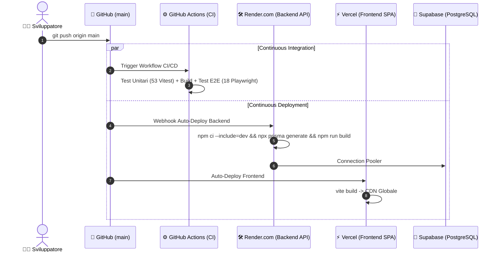

# 🎓 RoadToUnina — Piattaforma Web & Sfida Enciclopedica

[](https://road-to-unina.vercel.app)
[](https://roadtounina-backend.onrender.com/api/public/leaderboard)
[](https://supabase.com)
[](https://github.com/LucaBarrella/RoadToUnina/actions)

[](https://nodejs.org/)
[](https://expressjs.com/)
[](https://www.typescriptlang.org/)
[](https://react.dev/)
[](https://tailwindcss.com/)
[-44A833?logo=vitest&logoColor=white)](#-3-esecuzione-dei-test-automatizzati)
[-2EAD33?logo=playwright&logoColor=white)](#-3-esecuzione-dei-test-automatizzati)

Elaborato progettuale e implementazione full-stack per la traccia d'esame **RoadToUnina**: una piattaforma web competitiva in cui gli utenti registrati avviano una sfida partendo da una voce casuale estratta in tempo reale da Wikipedia e navigano, **esclusivamente attraverso i collegamenti ipertestuali interni verificati dal server**, per raggiungere la pagina dell'**Università degli Studi di Napoli Federico II** nel minor numero di click e nel minor tempo possibile.

> 🌐 **Live Cloud Demo:** [https://road-to-unina.vercel.app](https://road-to-unina.vercel.app)  
> 📄 **Requisiti Ufficiali:** Consulta il documento [REQUIREMENTS.md](./REQUIREMENTS.md) per i requisiti d'esame e le linee guida didattiche.  
> 🚀 **Guida Deployment:** Consulta [DEPLOYMENT.md](./DEPLOYMENT.md) per le istruzioni di deploy continuo e configurazione cloud.  
> 🛡️ **Specifiche Architetturali:** Consulta [backend/ARCHITECTURE.md](./backend/ARCHITECTURE.md) per i diagrammi UML (Casi d'Uso, Macchina a Stati, ER, Sequenza), OCC e matrice di tracciabilità.  
> 🔍 **Walkthrough Codice:** Consulta [backend/CODE_WALKTHROUGH.md](./backend/CODE_WALKTHROUGH.md) per l'analisi approfondita del sorgente backend.

---

## 👨‍🎓 Informazioni Progetto & Studente

| Campo | Dettaglio Accademico |
| :--- | :--- |
| **Istituzione** | **Università degli Studi di Napoli Federico II** |
| **Dipartimento** | Dipartimento di Ingegneria Elettrica e delle Tecnologie dell'Informazione (DIETI) |
| **Corso di Laurea** | Corso di Laurea Triennale in **Informatica** |
| **Insegnamento** | **Tecnologie Web** — Anno Accademico 2025/2026 (Spring 2026) |
| **Docente** | **Prof. Luigi Libero Lucio Starace, Ph.D.** |
| **Studente** | **Luca Barrella** |
| **Matricola** | **`N86004677`** |
| **Traccia Assegnata** | **RoadToUnina** *(Sezione 4 di [REQUIREMENTS.md](./REQUIREMENTS.md))* |

---

## 🎮 Regole di Gioco & Funzionalità

**RoadToUnina** è uno speedrun enciclopedico interattivo basato sulle voci di Wikipedia Italia:

1. **Origine Casuale:** Ad ogni nuova partita (`IN_PROGRESS`), il sistema estrae una voce di partenza casuale dal namespace principale (Namespace 0) di Wikipedia Italia.
2. **Obiettivo Finale:** Raggiungere la pagina target ufficiale dell'**Università degli Studi di Napoli Federico II** (`"Università degli Studi di Napoli Federico II"`).
3. **Navigazione Vincolata e Anti-Cheat:** 
   - Il giocatore può avanzare **esclusivamente** cliccando sui chip interattivi (`.wiki-chip`) corrispondenti a link interni validi (Namespace 0). Link esterni, portali e box di servizio vengono rimossi dal DOM.
   - Ogni click invia una richiesta HTTP `POST /api/games/:id/step`. Il backend valida lato server che il link sia effettivamente contenuto nella pagina corrente prima di avanzare.
4. **Condizioni di Conclusione:**
   - **Vittoria (`COMPLETED`):** Raggiungimento della pagina target. Vengono registrati nel database il numero totale di passi (click), la durata cronometrata in secondi e il percorso esatto di titoli visitati.
   - **Abbandono (`ABANDONED`):** Resa volontaria dell'utente tramite apposito pulsante.
5. **Persistenza Server-Side:** Lo stato di ogni partita è salvato in PostgreSQL, consentendo all'utente di riprendere la partita su qualsiasi dispositivo.
6. **Classifica & Leaderboard:** Gli utenti non registrati (ospiti) possono visualizzare la leaderboard globale ordinata per minor numero di click e minor tempo, con podio (1°, 2°, 3° posto) e storico delle partite concluse.

---

## 🔄 Come Funzionano gli Aggiornamenti Automatici (CI/CD)

Il repository è configurato con **Continuous Deployment automatico**:



### ⚡ Per aggiornare l'applicazione online:
È sufficiente eseguire una push sul branch `main`:
```bash
git add .
git commit -m "feat: nuova funzionalità"
git push origin main
```
- **Render.com** rileva il commit, compila il backend e lo aggiorna in ~60 secondi senza downtime.
- **Vercel** compila il frontend e aggiorna la CDN globale in ~30 secondi.
- **GitHub Actions** esegue automaticamente la suite di 53 test backend e 18 test E2E Playwright.

---

## 🐳 1. Avvio Rapido con Docker Compose (Locale)

Per eseguire l'intero stack in locale con un solo comando:

```bash
docker compose up --build
```

- **🖥️ Front-end SPA:** `http://localhost:5173` (o `http://localhost:80`)
- **⚙️ Back-end API:** `http://localhost:3001`
- **🗄️ Database PostgreSQL:** `localhost:5432`

---

## 💻 2. Esecuzione Locale / Sviluppo

### Prerequisiti
- **Node.js** v20.x o superiore
- **npm** v10.x o superiore

### Terminale 1: Back-end API
```bash
cd backend
npm install
npx prisma generate
npx prisma db push
npx prisma db seed   # Popola 10 utenti e 20 partite di test
npm run dev
```

### Terminale 2: Front-end SPA
```bash
cd frontend
npm install
npm run dev
```

---

## 🧪 3. Esecuzione dei Test Automatizzati

### ⚙️ Test di Backend (Vitest — 53 Test)
```bash
cd backend
npm test
```
- **`robustnessQA.test.ts` (25 test):** Validazione Zod, anti-cheat su Wikipedia, isolamento IDOR, race condition atomiche, timeout 24h.
- **`breakBackend.test.ts` (12 test):** Stress test (20 req simultanee), SQL injection, DoS protection, XSS filtering, JWT security.
- **`wikiService.test.ts` (8 test):** Parsing MediaWiki, estrazione link Namespace 0, DOM sanitization, caching LRU.
- **`gameService.test.ts` (8 test):** Ciclo di vita del gioco, transizioni di stato atomiche, vittoria e calcolo path.

### 🎭 Test End-to-End (Playwright — 19 Test)
```bash
cd frontend
npx playwright test
```
- **`gameplay.spec.ts` (6 test):** Registrazione, login, bot gameplay, speedrun completa, verifica leaderboard, anti-cheat & edge cases.
- **`live-verification.spec.ts` (1 test):** Resilienza, error recovery da titoli non validi e integrità del flusso.
- **`speedrun-moonknight.spec.ts` (1 test):** Playtest speedrun completo da *"Moon Knight"* a *"Università degli Studi di Napoli Federico II"*.
- **`thematic-speedruns.spec.ts` (6 test):**
  - 🎬 **Boris (Serie TV)** — *"Dai dai dai!"*: `"Boris (serie televisiva)"` ➔ `"Italia"` ➔ `"Napoli"` ➔ `"Università degli Studi di Napoli Federico II"`
  - 💾 **antirez (Salvatore Sanfilippo)** — `"Redis"` ➔ `"Salvatore Sanfilippo"` ➔ `"Italia"` ➔ `"Napoli"` ➔ `"Unina"`
  - 🤖 **Local LLMs & AI** — `"Intelligenza artificiale"` ➔ `"Alan Turing"` ➔ `"Seconda guerra mondiale"` ➔ `"Napoli"` ➔ `"Unina"`
  - ⚽ **Diego Armando Maradona (D10S)** — `"Diego Armando Maradona"` ➔ `"Napoli"` ➔ `"Unina"`
  - 🍕 **Pizza Napoletana** — `"Pizza napoletana"` ➔ `"Napoli"` ➔ `"Unina"` (2 Clicks)
  - 🎭 **Totò (Principe De Curtis)** — `"Totò"` ➔ `"Unina"` (1-Click Record)
- **`ux-accessibility.spec.ts` (5 test):**
  - 🌐 Esplorazione Ospite (Guest Mode) Leaderboard, Podio e Banner CTA.
  - 🔄 Persistenza sessione di gioco attiva al reload del browser (`page.reload()`).
  - 🛑 Ciclo di vita resa volontaria (Abbandona Partita) e riavvio immediato.
  - 🛡️ DOM Sanitization Wikipedia e Toast notification su link non validi.
  - 🚪 Routing Navbar e Logout sicuro con invalidazione localStorage.

---

## 🛠️ Stack Tecnologico Completo

```
┌────────────────────────────────────────────────────────────────────────┐
│                          ROADTOUNINA STACK                             │
├───────────────────┬────────────────────────────────────────────────────┤
│ Front-end SPA     │ React 19, TypeScript, Vite, Neo-Brutalism Design   │
│ Back-end API      │ Node.js (v20+), Express 5, TypeScript (Strict)     │
│ Cloud Database    │ Supabase (PostgreSQL 16) con Connection Pooler     │
│ Database Indexes  │ Indici compositi su Game(userId, status), GameStep │
│ Cloud Hosting     │ Vercel (Frontend) + Render.com (Backend)           │
│ Data Layer / ORM  │ Prisma ORM v7.9, @prisma/adapter-pg                │
│ Security & Anti-XSS│ Sanitize-HTML, Helmet, Rate Limiting, Bcrypt, JWT  │
│ Network & Proxy   │ Express trust proxy (accurata lettura IP client)  │
│ Caching Layer     │ LRU Cache In-Memory (TTL 1h, latenza < 1ms)        │
│ Test Runner       │ Vitest (53/53 passed) + Playwright (19/19 passed)  │
│ CI/CD Pipeline    │ GitHub Actions Workflows (.github/workflows)       │
└───────────────────┴────────────────────────────────────────────────────┘
```

---

<div align="center">
  <b>Università degli Studi di Napoli Federico II</b><br>
  <i>Corso di Laurea in Informatica — Tecnologie Web (Spring 2026)</i><br>
  <b>Luca Barrella</b> (Matricola <code>N86004677</code>)
</div>
