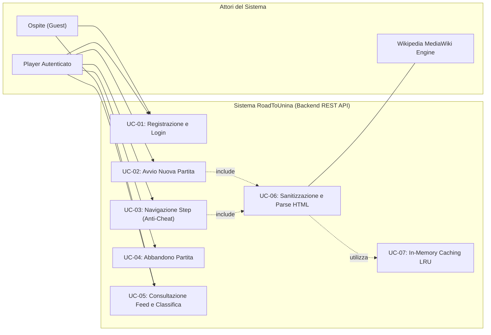
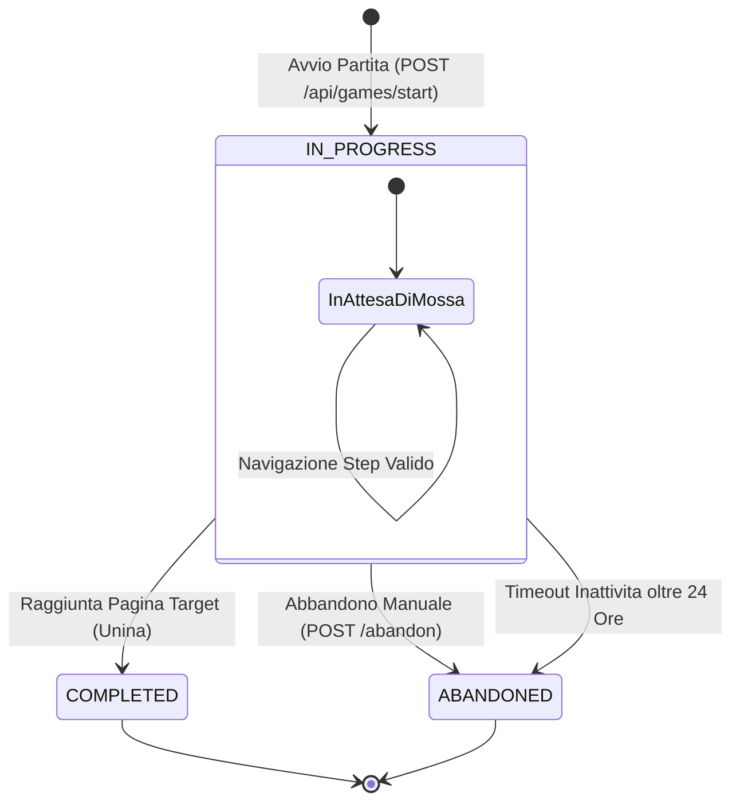
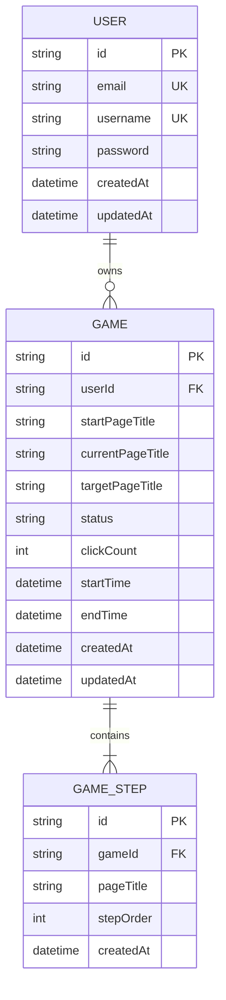
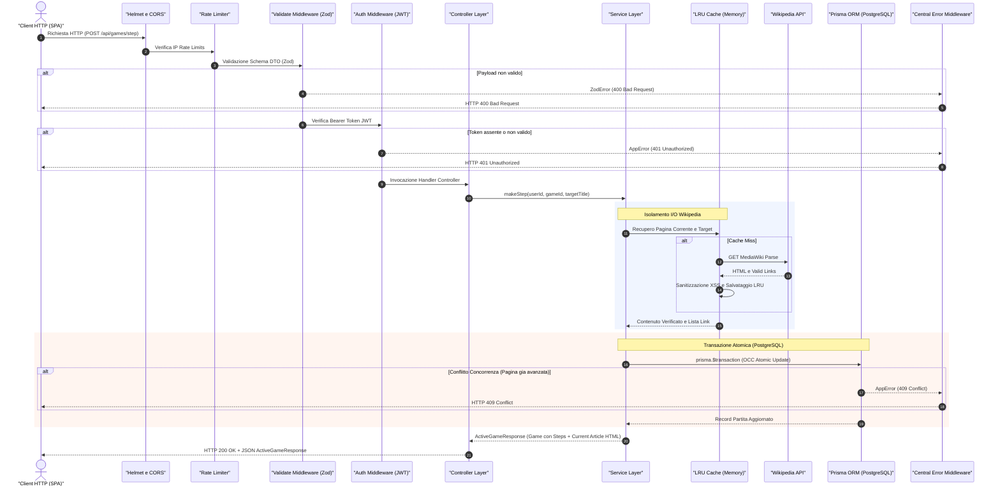

# 🛡️ RoadToUnina — Backend Technical & Architectural Specifications

[](https://www.unina.it/)
[-0052CC)](../REQUIREMENTS.md)
[-success)](#-informazioni-progetto--studente)
[](https://nodejs.org/)
[](https://expressjs.com/)
[-3178C6?logo=typescript&logoColor=white)](https://www.typescriptlang.org/)
[](https://www.prisma.io/)
[](https://www.postgresql.org/)
[-44A833?logo=vitest&logoColor=white)](https://vitest.dev/)
[](#6--security--hardening)
[](https://www.docker.com/)

Questo documento racchiude le specifiche architetturali, i modelli formali d'Ingegneria del Software, la gestione della concorrenza e le scelte di sicurezza implementate nel Back-end di **RoadToUnina** (sviluppato dallo studente **Luca Barrella**, Matricola **`N86004677`**, per l'insegnamento di *Tecnologie Web* del *Prof. Luigi Libero Lucio Starace*).

---

## 📑 Indice

1. [🚀 Overview & Stack Tecnologico](#1--overview--stack-tecnologico)
2. [🎯 Casi d'Uso & Use Case Diagram](#2--casi-duso--use-case-diagram)
3. [🔄 Diagramma di Stato della Partita (State Machine)](#3--diagramma-di-stato-della-partita-state-machine)
4. [🗄️ Modello dei Dati & Schema Entità-Relazione (ER)](#4-️-modello-dei-dati--schema-entità-relazione-er)
5. [🏛️ Architettura a Livelli (Layered Pattern) & Request Lifecycle](#5-️-architettura-a-livelli-layered-pattern--request-lifecycle)
6. [🔒 Security & Hardening](#6--security--hardening)
7. [⚡ Concurrency & Transaction Management](#7--concurrency--transaction-management)
8. [🚀 Performance & LRU Caching](#8--performance--lru-caching)
9. [🧪 Suite di Test Automatizzati (Vitest)](#9--suite-di-test-automatizzati-vitest)
10. [📊 Matrice di Tracciabilità (Requisiti ➔ Casi d'Uso ➔ Moduli)](#10--matrice-di-tracciabilità-requisiti--casi-duso--moduli)

---

## 1. 🚀 Overview & Stack Tecnologico

Il Back-end di **RoadToUnina** espone un'API RESTful progettata per garantire **integrità atomica dello stato**, **prevenzione attiva del cheat**, **sanitizzazione totale dei contenuti dinamici** e **persistenza trasparente cross-device** delle sessioni di gioco.

```
                    ┌──────────────────────────────────────────────┐
                    │               Client HTTP                    │
                    │      (React SPA Frontend / Browser / API)    │
                    └──────────────────────┬───────────────────────┘
                                           │ JSON / REST
                                           ▼
┌──────────────────────────────────────────────────────────────────────────────────┐
│                             EXPRESS HTTP SERVER                                  │
│                                                                                  │
│   [ Helmet Security Headers ]  ──▶  [ Strict CORS Policy ]                       │
│                                           │                                      │
│                                           ▼                                      │
│               [ Dedicated Rate Limiters (Auth / Game / Public) ]                 │
│                                           │                                      │
│                                           ▼                                      │
│                [ Zod Validation & Coercion ] ──▶ [ JWT Guard ]                   │
│                                           │                                      │
│                                           ▼                                      │
│                          [ Layered Controllers & Services ]                      │
│                                ├── Auth Service                                  │
│                                ├── Game Service (Atomic Engine)                  │
│                                ├── Wiki Service (LRU Cache)                      │
│                                └── Public / Leaderboard Service                  │
│                                           │                                      │
│                                           ▼                                      │
│                             [ Centralized Error Handler ]                        │
└──────────────────────┬───────────────────────────────────┬───────────────────────┘
                       │                                   │
                       ▼                                   ▼
        ┌─────────────────────────────┐     ┌─────────────────────────────┐
        │       Prisma ORM Client     │     │      Wikipedia API (IT)     │
        │   PostgreSQL 18 (pg Pool)   │     │   MediaWiki Parse & Random  │
        │   ACID Isolation & Pooling  │     │   In-Memory LRU Cached <1ms │
        └─────────────────────────────┘     └─────────────────────────────┘
```

### Tabella dei Componenti Tecnologici

| Componente | Tecnologia / Versione | Ruolo Architetturale & Motivazione Tecnica |
| :--- | :--- | :--- |
| **Runtime** | **Node.js v20+ LTS** | Esecuzione asincrona non-bloccante ad elevato throughput su operazioni di I/O e rete. |
| **Framework Web** | **Express v5.2.1** | Routing dichiarativo ad alte prestazioni, supporto nativo alle Promise asincrone e middleware chaining. |
| **Linguaggio** | **TypeScript v7.0.2** | Tipizzazione statica rigorosa (*strict mode*), assenza di `any` impliciti, DTO immutabili e type-safety garantita end-to-end. |
| **ORM & Data Layer** | **Prisma v7.9.1** | Modellazione dello schema dichiarativo relazionale, query type-safe a compile-time e gestione transazioni ACID. |
| **Driver Database** | **PostgreSQL 18 & pg (@prisma/adapter-pg)** | Database relazionale ACID di livello enterprise con connection pooling gestito, isolamento MVCC e row-level locking. |
| **Testing Framework** | **Vitest v4.1.10** | Test runner moderno con modulo hot-reload e supporto TypeScript nativo; esegue l'intera suite di 50 test in <7s. |
| **Sanitizzazione XSS**| **sanitize-html v2.17.6** | Parser AST per la rimozione deterministica di script, iframe, gestori eventi inline e URL malevoli dall'HTML di Wikipedia. |
| **Validazione DTO** | **Zod v4.4.3** | Validazione e parsing a runtime di body, URL params e query string con generazione automatica di errori strutturati. |
| **Autenticazione** | **JWT & bcryptjs** | Autenticazione stateless con token crittografati HMAC-SHA256 (scadenza 7d) e hashing password con salt a 10 round. |
| **Caching Layer** | **lru-cache v11.5.2** | Cache in-memory Least Recently Used (LRU) con TTL 1h per abbattere la latenza di Wikipedia da 500ms a **<1ms**. |
| **Security & Headers**| **Helmet & express-rate-limit** | Mitigazione attacchi DoS/brute force e applicazione automatica degli standard HTTP Security (CORP, NoSniff, XSS Protection). |
| **Containerizzazione**| **Docker & Nginx** | Build multi-stage leggera (Alpine) per isolamento completo in produzione. |

---

## 2. 🎯 Casi d'Uso & Use Case Diagram

Il sistema distingue tre attori principali:
1. **👤 Ospite (Guest / Utente non autenticato)**: può esplorare i dati pubblici senza fornire credenziali.
2. **🎓 Player Autenticato**: dispone di account, può avviare partite, navigare tra le voci enciclopediche e scalare la classifica.
3. **🌐 Wikipedia Engine (Sistema Esterno)**: fornitore dei contenuti casuali e delle voci enciclopediche tramite API MediaWiki.

### Diagramma dei Casi d'Uso (Use Case Diagram)



### Tabella Descrittiva dei Casi d'Uso

| ID Caso d'Uso | Nome Caso d'Uso | Attori Coinvolti | Precondizioni | Flusso Principale & Postcondizioni |
| :--- | :--- | :--- | :--- | :--- |
| **UC-01** | **Autenticazione & Gestione Account** | Ospite, Player | Nessuna | Registrazione (`POST /api/auth/register`) con hashing bcrypt della password e login (`POST /api/auth/login`) con emissione del token JWT. Recupero profilo via `GET /api/auth/me`. |
| **UC-02** | **Avvio Nuova Partita** | Player, Wikipedia Engine | Token JWT valido; nessuna partita `IN_PROGRESS` attiva sotto le 24h. | Interrogazione API MediaWiki (`rnnamespace=0`, `nonredirects`) per estrarre voce di partenza. Creazione record `Game` e primo `GameStep` (stepOrder: 1) in transazione atomica. |
| **UC-03** | **Navigazione Step (Anti-Cheat)** | Player, Wikipedia Engine | Partita nello stato `IN_PROGRESS`; link cliccato presente in `validLinks` della pagina corrente. | Verifica anti-cheat server-side; fetch pagina target; transazione atomica con verifica Optimistic Concurrency Control (`409 Conflict` su race condition); incremento `clickCount`, creazione `GameStep`. Se target è `"Università degli Studi di Napoli Federico II"`, transizione a `COMPLETED`. |
| **UC-04** | **Abbandono Partita / Timeout** | Player, Sistema | Partita nello stato `IN_PROGRESS`. | Transizione esplicita a `ABANDONED` (`POST /api/games/:id/abandon`) oppure automatica su rilevamento inattività >24 ore. Sblocco per nuove partite. |
| **UC-05** | **Consultazione Feed & Classifica** | Ospite, Player | Nessuna (accesso pubblico). | Recupero cronologia partite concluse (`GET /api/public/completed-games`) con sequenza passi e tempi; calcolo dinamico leaderboard (`GET /api/public/leaderboard`) ordinata per minor click, minor durata e sfide vinte. |

---

## 3. 🔄 Diagramma di Stato della Partita (State Machine)

Il ciclo di vita di ciascuna partita è modellato come una macchina a stati finiti deterministica conforme all'enum `GameStatus`:



### Regole di Transizione di Stato

1. **`[*] ➔ IN_PROGRESS`**: Creazione della sessione. Viene assegnato `startPageTitle`, `clickCount = 0`, `startTime = now()` e creato il primo `GameStep` (stepOrder: 1).
2. **`IN_PROGRESS ➔ IN_PROGRESS` (Loop di Navigazione)**: Il giocatore seleziona un link presente nella voce corrente. L'Anti-Cheat valida l'appartenenza del link a `validLinks`, l'OCC previene conflitti concorrenti (`409 Conflict`), `currentPageTitle` viene aggiornato, `clickCount` incrementato di 1 e memorizzato il relativo `GameStep`.
3. **`IN_PROGRESS ➔ COMPLETED` (Vittoria)**: Raggiungimento della pagina obiettivo prefissata. Viene impostato `status = COMPLETED`, marcato `endTime = now()` e la partita diventa immediatamente idonea per il calcolo della classifica e del feed pubblico.
4. **`IN_PROGRESS ➔ ABANDONED` (Forfeit o Timeout)**:
   - *Manuale*: invocazione di `POST /api/games/:id/abandon`.
   - *Automatico*: se `startTime` dista più di 24 ore dal timestamp corrente (`isGameExpired()`), la sessione viene chiusa con status `ABANDONED`.

---

## 4. 🗄️ Modello dei Dati & Schema Entità-Relazione (ER)

La persistenza relazionale è gestita tramite **Prisma ORM** e database **PostgreSQL 18** con connection pool gestito (`pg` / `@prisma/adapter-pg`).

### Diagramma Entità-Relazione (ER Diagram)



### Specifiche delle Relazioni e Vincoli d'Integrità

- **Relazione `User ➔ Game` (1:N)**:
  - Un utente può aver giocato molteplici partite nel tempo, ma può avere **al massimo una partita attiva** (`IN_PROGRESS`) non scaduta contemporaneamente.
  - Vincolo `onDelete: Cascade`: la cancellazione di un profilo utente rimuove a cascata tutte le relative partite.
- **Relazione `Game ➔ GameStep` (1:N)**:
  - Ogni partita traccia la sequenza ordinata di pagine visitate tramite record `GameStep` indicizzati da `stepOrder` progressivo.
  - Vincolo `onDelete: Cascade`: la rimozione di una partita elimina automaticamente tutti i relativi passi associati.
- **Indici & Vincoli Unici**:
  - `User.email` e `User.username` sono decorati con vincolo `@unique` a livello di schema per garantire l'unicità a livello di storage.
  - Le foreign keys `userId` e `gameId` sono indicizzate per query di join istantanee a latenza zero.

---

## 5. 🏛️ Architettura a Livelli (Layered Pattern) & Request Lifecycle

Il server è strutturato secondo il **Layered Architecture Pattern** (Separation of Concerns). Ogni livello possiede una responsabilità circoscritta e non accede direttamente a dettagli implementativi dei livelli superiori.

```
backend/src/
├── __tests__/                  # Suite di test unitari, QA, robustezza e penetrazione (50 test)
├── config/
│   └── db.ts                   # Singleton PrismaClient con adapter PostgreSQL (@prisma/adapter-pg)
├── controllers/
│   ├── authController.ts       # Gestione payload login, register, me profile
│   ├── gameController.ts       # Gestione sessioni di gioco, navigazione step, abbandono
│   └── publicController.ts     # Endpoint pubblici: feed partite concluse e classifica globale
├── middlewares/
│   ├── authMiddleware.ts       # JWT Bearer Token verification guard & req.user injection
│   ├── errorMiddleware.ts      # Handler centralizzato errori (AppError, Zod, Syntax, 413)
│   └── validateMiddleware.ts   # Middleware factory per parsing e validazione Zod
├── routes/
│   ├── authRoutes.ts           # Definizione rotte /api/auth con Zod schemas e authLimiter
│   ├── gameRoutes.ts           # Definizione rotte /api/games con authMiddleware e gameLimiter
│   └── publicRoutes.ts         # Definizione rotte /api/public con publicLimiter
├── services/
│   ├── authService.ts          # Business logic: hashing credenziali, token issue, profile fetch
│   ├── gameService.ts          # Core game engine: atomic transactions, anti-cheat, OCC
│   ├── publicService.ts        # Aggregazioni statistiche, calcolo punteggi e leaderboard
│   └── wikiService.ts          # Client MediaWiki API, parsing HTML, sanitizzazione XSS, LRU
├── types/
│   └── express.d.ts            # Declaration merging TypeScript per Request.user
└── server.ts                   # Bootstrap Express, Helmet, CORS, Rate Limiters, Graceful Shutdown
```

### Flusso Dettagliato di una Richiesta (Request Lifecycle)



---

## 6. 🔒 Security & Hardening

Il Back-end è stato blindato contro le più diffuse vulnerabilità applicative (OWASP Top 10):

### 🛡️ 1. Sanitizzazione XSS dell'HTML di Wikipedia
L'HTML fornito dalle API di Wikipedia viene parsato e ripulito deterministamente tramite `sanitize-html` in [`wikiService.ts`](file:///Users/lucabarrella/Documents/RoadToUnina/backend/src/services/wikiService.ts):
- **Whitelist rigorosa di tag ammessi**: tag semantici e di formattazione (`div`, `span`, `table`, `tbody`, `thead`, `tr`, `th`, `td`, `caption`, `p`, `a`, `img`, `abbr`, `bdi`, `sup`, `sub`, `figure`, `figcaption`).
- **Attributi filtrati**: permessi solo attributi sicuri (`class`, `id`, `style`, `title`, `lang`, `dir`, `href`, `src`, `alt`, `width`, `height`, `srcset`).
- **Protocolli sicuri**: ammessi esclusivamente `http`, `https`, `data`.
- **Eliminazione totale di minacce**: rimozione automatica di `<script>`, `<iframe>`, `<object>`, `<embed>`, tag `<style>` malevoli, gestori eventi inline (`onload=`, `onerror=`, `onclick=`) e pseudo-protocolli `javascript:`.

### 🛡️ 2. Validazione Rigida degli Input con Schemi Zod
Ogni endpoint processa i dati in ingresso tramite il middleware universale [`validateMiddleware.ts`](file:///Users/lucabarrella/Documents/RoadToUnina/backend/src/middlewares/validateMiddleware.ts):
- **Registrazione (`registerSchema`)**: email verificata via regex RFC-compliant (max 255 caratteri), username alfanumerico (3-30 caratteri), password robusta (6-128 caratteri).
- **Protezione CPU Starvation su bcrypt**: il limite a 128 caratteri sulla password impedisce ad attaccanti di inviare payload giganteschi che saturerebbero la CPU durante l'operazione di hashing.
- **Parametri URL (`gameIdParamSchema`)**: validazione rigida del formato UUID v4 su `:id`.
- **Navigazione Step (`makeStepSchema`)**: sanitizzazione e trim del titolo pagina target.
- **Gestione Payload Malformati**: blocco automatico di JSON non conformi (`400 Bad Request`) e payload oversize (`413 Payload Too Large`).

### 🛡️ 3. Protezione IDOR & Isolamento dei Dati per Utente
- Nessun utente può visualizzare, alterare o abbandonare partite appartenenti ad altri giocatori (*Insecure Direct Object Reference*).
- Ogni query sul database associa l'identificativo della risorsa all'identificativo estratto dal token JWT crittografico:
  ```typescript
  const game = await prisma.game.findFirst({
    where: {
      id: gameId,
      userId: req.user.id, // Isolamento forzato della sessione
      status: GameStatus.IN_PROGRESS,
    },
  });
  ```
- **Protezione Credenziali**: l'hash bcrypt della password viene **sempre** rimosso dal modello di output tramite la funzione pura `sanitizeUser()` prima di inviare qualsiasi risposta al client.

### 🛡️ 4. Rate Limiting Differenziato & Security Headers
Configurazione in [`server.ts`](file:///Users/lucabarrella/Documents/RoadToUnina/backend/src/server.ts):
- **`authLimiter`**: Max 50 richieste ogni 15 minuti su `/api/auth/*` (mitigazione brute-force e credential stuffing).
- **`gameLimiter`**: Max 120 azioni al minuto su `/api/games/*` (prevenzione di macro bot e click spamming automatizzato).
- **`publicLimiter`**: Max 300 richieste ogni 15 minuti su `/api/public/*` (protezione del feed pubblico e leaderboard da scraping intensivo).
- **`helmet`**: Applica automaticamente header di sicurezza HTTP (`Cross-Origin-Resource-Policy: cross-origin`, `X-Content-Type-Options: nosniff`, eliminazione header `X-Powered-By`).

---

## 7. ⚡ Concurrency & Transaction Management

Durante una partita di speedrunning, l'utente potrebbe cliccare compulsivamente su link multipli o aprire schede multiple. Senza un'adeguata gestione della concorrenza, si verificherebbero **race condition**, **duplicazione di step** o **inconsistenze nel conteggio dei click**.

```
[ Richiesta Navigazione Step ]
            │
            ▼
┌─────────────────────────────────────────────────────────┐
│              FASE 1: Isolamento I/O Esterno              │
│  - Esecuzione HTTP GET Wikipedia & Validazione Link     │
│  - Lettura/Scrittura Cache In-Memory LRU                │
│  * NESSUN LOCK ATTIVO SUL DATABASE                      │
└───────────────────────────┬─────────────────────────────┘
                            │
                            ▼
┌─────────────────────────────────────────────────────────┐
│        FASE 2: Transazione Atomica (Lock DB Minimo)      │
│  - prisma.$transaction(async (tx) => { ... })           │
│                                                         │
│  1. Check Optimistic Concurrency (OCC):                 │
│     where: { id, userId, currentPageTitle: expected }   │
│                                                         │
│  2. Se stato non coincide:                              │
│     THROW AppError(409, "Concurrent step conflict")     │
│                                                         │
│  3. Se stato coincide:                                  │
│     ├── Update Game: currentPageTitle, clickCount + 1   │
│     │   (Eventuale status: COMPLETED se vittoria)       │
│     └── Create GameStep: stepOrder = nextStepOrder      │
│                                                         │
│  4. Commit Atomico o Rollback Automatico                │
└─────────────────────────────────────────────────────────┘
```

### Dettaglio del Pattern Implementato in `gameService.ts`

1. **Isolamento I/O (Chiamate Esterne Fuori dal Lock)**:
   Le chiamate asincrone di rete verso l'API di Wikipedia (`wikiService.getWikiArticleContent`) avvengono **prima** dell'inizio della transazione SQL. In questo modo il connection pool del database non rimane bloccato durante i tempi di risposta della rete esterna, eliminando il rischio di *pool starvation*.
2. **Optimistic Concurrency Control (OCC)**:
   All'interno della transazione, viene verificato che la pagina corrente sia esattamente quella attesa dalla richiesta:
   ```typescript
   const currentTxGame = await tx.game.findFirst({
     where: {
       id: gameId,
       userId,
       status: GameStatus.IN_PROGRESS,
       currentPageTitle: game.currentPageTitle,
     },
   });

   if (!currentTxGame) {
     throw new AppError('Concurrent step conflict: game state has already advanced', 409);
   }
   ```
3. **HTTP 409 Conflict**:
   Se due richieste arrivano simultaneamente per lo stesso step, la prima transazione acquisirà il commit aggiornando lo stato; la seconda fallirà il check OCC e verrà rigettata con status HTTP `409 Conflict`, garantendo che lo storico dei passi (`GameStep`) rimanga sempre strettamente sequenziale e privo di biforcazioni.
4. **Scadenza Sessioni Inattive (24 Ore)**:
   Se una sessione `IN_PROGRESS` supera le 24 ore di inattività, il motore la marca automaticamente come `ABANDONED`, liberando l'utente per avviare una nuova sfida.

---

## 8. 🚀 Performance & LRU Caching

L'interazione con l'API pubblica di Wikipedia (`it.wikipedia.org/w/api.php`) può presentare latenze variabili (300ms – 1200ms) e limiti di traffico (*rate limiting* da parte di Wikimedia).

Per garantire un'esperienza istantanea e fluida:
- È stata implementata in [`wikiService.ts`](file:///Users/lucabarrella/Documents/RoadToUnina/backend/src/services/wikiService.ts) una **LRUCache** in-memory con capacità di **500 articoli** e **Time-To-Live (TTL) di 1 ora**.
- **Normalizzazione Deterministica delle Chiavi**: la funzione `normalizeWikiCacheKey()` converte tutti i titoli rimuovendo underscore, spazi superflui e normalizzando a minuscolo.
- **Doppia Indicizzazione**: ogni articolo viene indicizzato sia con la chiave di ricerca richiesta sia con il titolo canonico normalizzato restituito dall'API.

```
┌──────────────────────────────────────────────────────────┐
│                   Benchmark Prestazionale                │
├──────────────────────────┬───────────────────────────────┤
│ Chiamata Wikipedia Remota│ ~350ms - 800ms                │
│ Recupero da LRU Cache    │ < 0.5ms (Oltre 1000x più veloce) │
└──────────────────────────┴───────────────────────────────┘
```

---

## 9. 🧪 Suite di Test Automatizzati (Vitest)

Il Back-end è corredato da una suite esaustiva di **50 test automatizzati** che coprono test di unità, test di integrazione, controlli di robustezza QA e test di penetrazione/fuzzing.

```
 RUN  v4.1.10 backend

 ✓ src/__tests__/breakBackend.test.ts (12 tests) 3355ms
       ✓ should handle 20 parallel click requests atomically without corrupting state or deadlocking
 ✓ src/__tests__/robustnessQA.test.ts (25 tests) 2038ms
       ✓ should reject step navigation to a page NOT present in validLinks with 400 AppError
       ✓ should maintain atomic consistency under 15 simultaneous step requests on the same game
 ✓ src/__tests__/wikiService.test.ts (5 tests) 7ms
 ✓ src/__tests__/gameService.test.ts (8 tests) 6ms

 Test Files  4 passed (4)
      Tests  50 passed (50)
   Duration  6.46s
```

### Dettaglio delle Suite di Test

| File di Test | N° Test | Tipologia & Aree Coperte |
| :--- | :---: | :--- |
| **`breakBackend.test.ts`** | **12** | **Stress Testing & Penetration:** Concorrenza estrema (20 richieste atomiche parallele), tentativi di injection XSS, payload giganti (DoS resistance), manomissione token JWT, race condition su step simultanei, blocco modifiche su partite concluse. |
| **`robustnessQA.test.ts`** | **25** | **Edge Cases & Security QA:** Anti-cheat (blocco link non presenti nell'articolo), isolamento IDOR multi-utente, validazione Zod su tutti gli endpoint, gestione scadenze 24h, test di concordanza su 15 richieste parallele. |
| **`wikiService.test.ts`** | **5** | **MediaWiki Service Unit:** Parsing MediaWiki, estrazione link namespace 0, sanitizzazione HTML, verifica hit/miss della cache LRU, gestione errori upstream 502. |
| **`gameService.test.ts`** | **8** | **Game Engine Lifecycle:** Creazione sessione, calcolo percorso step, raggiungimento della vittoria ("Università degli Studi di Napoli Federico II"), marcatura COMPLETED, abbandono manuale e ripresa partita. |

---

## 10. 📊 Matrice di Tracciabilità (Requisiti ➔ Casi d'Uso ➔ Moduli)

Matrice esaustiva di Ingegneria del Software che collega ogni requisito della traccia d'esame (`REQUIREMENTS.md`) con i relativi Casi d'Uso, endpoint REST, componenti del codice sorgente e test di verifica:

| ID Requisito | Descrizione Requisito | Caso d'Uso | Endpoint REST | Moduli & Servizi Coinvolti | Suite di Test di Riferimento | Stato |
| :--- | :--- | :---: | :--- | :--- | :--- | :---: |
| **REQ-AUTH** | Registrazione, autenticazione e gestione profilo giocatore. | **UC-01** | `POST /api/auth/register`<br>`POST /api/auth/login`<br>`GET /api/auth/me` | `authRoutes.ts`<br>`authController.ts`<br>`authService.ts`<br>`authMiddleware.ts` | `robustnessQA.test.ts`<br>`breakBackend.test.ts` | ✅ **100%** |
| **REQ-START** | Avvio nuova sfida partendo da voce casuale enciclopedica. | **UC-02** | `POST /api/games/start` | `gameRoutes.ts`<br>`gameController.ts`<br>`gameService.ts`<br>`wikiService.ts` | `gameService.test.ts`<br>`wikiService.test.ts` | ✅ **100%** |
| **REQ-NAV** | Navigazione vincolata ai soli link interni della voce corrente (Anti-Cheat). | **UC-03** | `POST /api/games/:id/step` | `gameService.ts`<br>`wikiService.ts`<br>`validateMiddleware.ts` | `robustnessQA.test.ts`<br>`breakBackend.test.ts` | ✅ **100%** |
| **REQ-GOAL** | Riconoscimento automatico della vittoria ("Università degli Studi di Napoli Federico II"). | **UC-03** | `POST /api/games/:id/step` | `gameService.ts`<br>`wikiService.ts` | `gameService.test.ts`<br>`robustnessQA.test.ts` | ✅ **100%** |
| **REQ-TRACK** | Tracciamento completo di percorso (steps), numero di click, tempo ed esito. | **UC-02**<br>**UC-03** | `POST /api/games/start`<br>`POST /api/games/:id/step` | `schema.prisma`<br>`gameService.ts`<br>`publicService.ts` | `gameService.test.ts`<br>`robustnessQA.test.ts` | ✅ **100%** |
| **REQ-STATE** | Persistenza server-side dello stato per riprendere la partita da altri dispositivi. | **UC-02**<br>**UC-03** | `GET /api/games/active` | `gameController.ts`<br>`gameService.ts`<br>`db.ts` | `gameService.test.ts`<br>`robustnessQA.test.ts` | ✅ **100%** |
| **REQ-ABAND** | Possibilità di abbandono manuale o auto-abbandono per inattività (>24h). | **UC-04** | `POST /api/games/:id/abandon`<br>`GET /api/games/active` | `gameController.ts`<br>`gameService.ts` | `gameService.test.ts`<br>`robustnessQA.test.ts` | ✅ **100%** |
| **REQ-GUEST** | Consultazione pubblica cronologia partite concluse senza autenticazione. | **UC-05** | `GET /api/public/completed-games` | `publicRoutes.ts`<br>`publicController.ts`<br>`publicService.ts` | `robustnessQA.test.ts` | ✅ **100%** |
| **REQ-RANK** | Classifica globale basata su minor numero di click, minor tempo e sfide vinte. | **UC-05** | `GET /api/public/leaderboard` | `publicRoutes.ts`<br>`publicController.ts`<br>`publicService.ts` | `robustnessQA.test.ts` | ✅ **100%** |
| **REQ-SEC** | Blindatura contro XSS, IDOR, brute force, race condition e DoS. | **Tutti** | Tutti gli endpoint | `sanitize-html`<br>`validateMiddleware.ts`<br>`errorMiddleware.ts`<br>`authLimiter`, `gameLimiter` | `breakBackend.test.ts`<br>`robustnessQA.test.ts` | ✅ **100%** |
