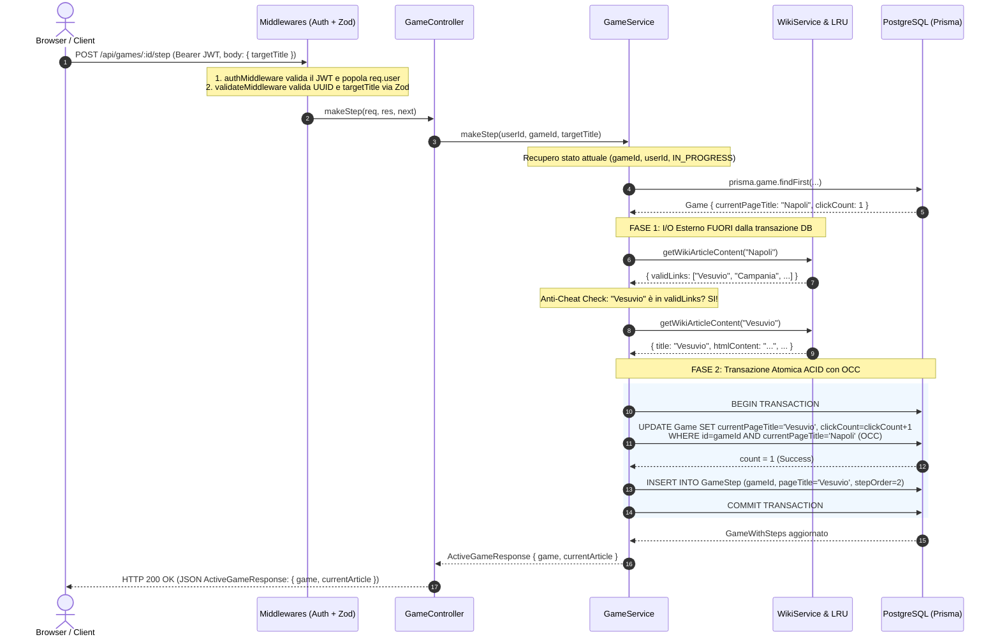

# 🎓 RoadToUnina — Backend Exam Guide & Code Walkthrough

Questa guida è redatta specificamente come **supporto completo allo studio e alla discussione orale** dell'elaborato progettuale per l'esame di *Tecnologie Web* (A.A. 2025/2026, Prof. Luigi Libero Lucio Starace).

Copre **il 100% dell'architettura del backend**, analizzando ogni file sorgente, modello dati, middleware, controller, servizio e suite di test automatizzati.

---

## 🧭 1. Mappa di Navigazione e Flusso del Codice

### 1.1 Architettura a Livelli (Layered Architecture)
Il backend adotta una rigida **separazione delle responsabilità (Separation of Concerns)** ispirata alla *Clean Architecture* e al minimalismo pragmatico (*Stile Antirez*):

```
                                  [ Client / Browser (SPA) ]
                                              │ HTTP Request (Bearer JWT, JSON)
                                              ▼
┌──────────────────────────────────────────────────────────────────────────────────────┐
│ 1. Express Router & Security Middlewares (`src/server.ts`, `src/middlewares/`)       │
│    • Helmet (Security Headers HTTP: CSP, nosniff, frame-options)                     │
│    • CORS & Rate Limiters differenziati (auth, game, public)                         │
│    • authMiddleware (Verifica crittografica firma JWT, estrazione utente)            │
│    • validateMiddleware (Validazione payload/params con Zod e DTO tipizzati)         │
└──────────────────────────────────────────┬───────────────────────────────────────────┘
                                           │ DTO Sanitizzato & Tipizzato
                                           ▼
┌──────────────────────────────────────────────────────────────────────────────────────┐
│ 2. Controllers / Transport Layer (`src/controllers/`)                                │
│    • authController (register, login, me)                                            │
│    • gameController (startGame, getActiveGame, makeStep, abandonGame)               │
│    • publicController (getCompletedGames, getLeaderboard)                            │
│    • Estrazione parametri (req.params, req.body, req.user) e risposta JSON          │
└──────────────────────────────────────────┬───────────────────────────────────────────┘
                                           │ Invocazione Metodo di Business Logic
                                           ▼
┌──────────────────────────────────────────────────────────────────────────────────────┐
│ 3. Services / Business Logic Layer (`src/services/`)                                 │
│    • authService (Bcrypt hash, JWT signing, profile sanitization)                    │
│    • gameService (Macchina a stati, timeout 24h, anti-cheat, OCC con HTTP 409)      │
│    • wikiService (Client MediaWiki API, LRUCache in-memory, AST-based XSS sanitize) │
│    • publicService (Calcolo durate, ranking a 3 criteri, cronologia step)           │
└─────────────────────────────┬──────────────────────────────────────┬─────────────────┘
                              │                                      │
               Prisma Client + pg Pool                     Axios (HTTP Client)
               (`src/config/db.ts`)                                  ▼
                              ▼                      ┌─────────────────────────────────┐
           ┌────────────────────────────────────┐    │ MediaWiki API (it.wikipedia.org)│
           │ PostgreSQL Database                │    │ (action=parse, action=query)    │
           │ (Tabelle: User, Game, GameStep)    │    └─────────────────────────────────┘
           └────────────────────────────────────┘
```

---

### 1.2 "La Rotta di una Richiesta": Ciclo di Vita di `POST /api/games/:id/step`
Cosa accade esattamente quando un utente clicca su un link nel browser per avanzare di un passo?



---

## 💎 2. Le 5 "Chicche" Architetturali da Sfoggiare all'Esame

Se il docente chiede: *"Quali accorgimenti ingegneristici avete adottato per garantire prestazioni, sicurezza e robustezza?"*, esponi questi 5 punti cardine:

### 1. Isolamento dell'I/O di Rete fuori dal DB Lock (Prevenzione Connection Pool Starvation)
- **Problema:** Una transazione di database (`BEGIN ... COMMIT`) tiene occupata una connessione fisica del pool PostgreSQL. Le chiamate HTTP verso API esterne (Wikipedia) hanno latenze variabili da 100ms a svariati secondi.
- **Rischio Evitato:** Se inserissimo `axios.get()` dentro `prisma.$transaction`, 50 richieste concorrenti saturerebbero l'intero pool di connessioni (`max: 50`), portando l'intero server in **Connection Starvation** e bloccando anche login e registrazione.
- **Nostra Soluzione:** Tutte le chiamate a `wikiService.getWikiArticleContent()` avvengono **prima e fuori** dal blocco `prisma.$transaction`. La transazione DB dura solo **~2-5 millisecondi**, eseguendo unicamente le query SQL necessarie.

---

### 2. Anti-Cheat a Livello di Grafo (Namespace 0 Integrity)
- **Problema:** Un utente malevolo potrebbe intercettare la richiesta HTTP o usare Postman per inviare direttamente `targetTitle: "Università degli Studi di Napoli Federico II"` partendo da una pagina non collegata.
- **Nostra Soluzione:**
  1. Il server interroga il payload MediaWiki della pagina corrente.
  2. Estrae solo i link con `ns === 0` (Namespace 0 = sole voci enciclopediche ufficiali, escludendo pagine utente, discussioni, file o categorie).
  3. Verifica con normalizzazione stringa insensitive che il `targetTitle` richiesto esista davvero nell'array `validLinks`. In caso contrario, scarta la richiesta con **HTTP 400 Bad Request**.

---

### 3. Optimistic Concurrency Control (OCC) con HTTP 409 Conflict
- **Problema:** Se l'utente fa un "doppio click rapido" o invia 10 richieste parallele dallo stesso stato di partenza, rischiamo *race conditions*, click multipli registrati a vuoto o duplicazione di step.
- **Nostra Soluzione:**
  Utilizziamo `currentPageTitle` come **Version Tag Ottimistico**:
  ```typescript
  const updateResult = await tx.game.updateMany({
    where: {
      id: gameId,
      userId,
      status: GameStatus.IN_PROGRESS,
      currentPageTitle: game.currentPageTitle, // Tag di controllo concorrenza
    },
    data: {
      currentPageTitle: resolvedTitle,
      clickCount: { increment: 1 },
      ...(isVictory ? { status: GameStatus.COMPLETED, endTime: new Date() } : {}),
    },
  });

  if (updateResult.count === 0) {
    throw new AppError('Concurrent step conflict: game state has already advanced', 409);
  }
  ```
  La prima richiesta aggiorna lo stato atomico. Tutte le richieste concorrenti trovano `updateResult.count === 0` e vengono respinte con **HTTP 409 Conflict**, garantendo che la cronologia e il contatore dei click siano matematicamente coerenti.

---

### 4. Cache LRU In-Memory con Strategia a Doppia Chiave (Dual-Key)
- **Problema:** Wikipedia restituisce pagine identiche sia per redirect che per titoli con diversa formattazione (`"Napoli"` vs `"napoli"` vs `"Napoli (città)"`).
- **Nostra Soluzione:**
  Implementiamo una cache **LRU (Least Recently Used)** con dimensione massima di 500 elementi e TTL di 1 ora:
  ```typescript
  wikiArticleCache.set(normalizeWikiCacheKey(title), result);
  wikiArticleCache.set(normalizeWikiCacheKey(articleTitle), result);
  ```
  Salviamo il risultato indicizzandolo **sia per la chiave cercata che per il titolo canonico risolto**. Il tempo di risposta per pagine calde passa da **~400ms a <1ms**.

---

### 5. Sanitizzazione XSS AST-Based su HTML Wikipedia
- **Problema:** Il markup restituito da Wikipedia contiene tag non sicuri, script di tracking o attributi come `onerror`, `onload`, `javascript:` che esporrebbero il client ad attacchi **Stored XSS**.
- **Nostra Soluzione:**
  In [`wikiService.ts`](file:///Users/lucabarrella/Documents/RoadToUnina/backend/src/services/wikiService.ts), l'HTML grezzo viene parsato come albero sintattico (AST) tramite `sanitize-html` applicando una whitelist ferrea di tag (`p`, `div`, `table`, `a`, `img`) e attributi, spogliando qualsiasi elemento eseguibile prima ancora che il dato lasci il server.

---

## 📁 3. Guida Modulo per Modulo all'Intero Backend

### 3.1 `src/server.ts` (Entry Point & Infrastruttura HTTP)
- **Rate Limiting Differenziato:**
  - `authLimiter`: 50 richieste/15min su `/api/auth` contro brute-force e credential stuffing.
  - `gameLimiter`: 120 azioni/min su `/api/games` contro script macro/bot.
  - `publicLimiter`: 300 richieste/15min su `/api/public`.
- **CORS & Security:** `createCorsOptions` definisce la whitelist delle origini abilitate con supporto cookie/header (`credentials: true`). `helmet` applica security headers essenziali.
- **Graceful Shutdown (`gracefulShutdown`):** Intercetta i segnali `SIGINT` (Ctrl+C) e `SIGTERM` (arresto container Docker), chiudendo ordinatamente il pool di connessioni Prisma (`prisma.$disconnect()`) prima di terminare il processo Node.js.

---

### 3.2 `src/config/db.ts` (Database Pool & Adapter)
- **PostgreSQL Connection Pool:** Utilizza il driver nativo `pg.Pool` configurato con parametri ad alta concorrenza:
  - `max: 50` connessioni simultanee massime.
  - `idleTimeoutMillis: 30000` (rilascio connessioni inattive dopo 30s).
  - `connectionTimeoutMillis: 10000` (timeout di connessione a 10s).
- **PrismaPg Driver Adapter:** Integra `@prisma/adapter-pg` con l'istanza singleton `PrismaClient` esportata in tutto il backend.

---

### 3.3 `prisma/schema.prisma` (Modello Dati Relazionale)
- **`User`:** Memorizza `email` (unique), `username` (unique), `password` (hash bcrypt), timestamp e relazione 1-a-N con `Game`.
- **`Game`:**
  - `startPageTitle`, `currentPageTitle`, `targetPageTitle` (default: `"Università degli Studi di Napoli Federico II"`).
  - `status`: Enum (`IN_PROGRESS`, `COMPLETED`, `ABANDONED`).
  - `clickCount`: Contatore incrementale dei passi.
  - `startTime`, `endTime` (nullable, valorizzato solo al completamento).
  - `onDelete: Cascade`: La cancellazione di un utente o di un gioco elimina a cascata tutti i record correlati in `GameStep`.
- **`GameStep`:** Memorizza la sequenza ordinata (`stepOrder`, `pageTitle`, `gameId`, `createdAt`).

---

### 3.4 `src/types/express.d.ts` (TypeScript Declaration Merging)
- Estende la definizione di tipo nativa di Express (`declare global { namespace Express { interface Request { user?: { id: string; username: string } } } }`).
- Consente a tutti i controller di accedere a `req.user.id` e `req.user.username` con Type Safety rigorosa senza dover ricorrere a type casting manuale.

---

### 3.5 `src/middlewares/` (Pipeline di Sicurezza e Validazione)
1. **`authMiddleware.ts`:**
   - Estrae il token Bearer dall'header `Authorization`.
   - Verifica la firma crittografica con `jwt.verify(token, JWT_SECRET)`.
   - Popola `req.user` o solleva `AppError(401, 'Unauthorized')`.
2. **`validateMiddleware.ts`:**
   - Middleware generico a factory (`validateMiddleware(schema, 'body' | 'params' | 'query')`).
   - Esegue il parsing asincrono con Zod (`schema.parseAsync`).
   - Sostituisce l'oggetto della richiesta con i dati puliti/validati o passa l'errore a `next(error)`.
3. **`errorMiddleware.ts`:**
   - Centralizza la gestione di tutte le eccezioni:
     - `AppError`: Restituisce `{ error: message }` con il rispettivo status code.
     - `ZodError`: Restituisce `{ error: 'Validation Error', details: [{ field, message }] }` con HTTP 400.
     - `isPayloadTooLargeError`: HTTP 413.
     - `isMalformedJsonError`: HTTP 400.
     - Errori non gestiti: Logga l'errore e restituisce HTTP 500 generico senza esporre dettagli interni.

---

### 3.6 `src/routes/` & `src/controllers/` (Transport Layer)
1. **`authRoutes.ts` & `authController.ts`:**
   - `POST /api/auth/register`: Valida `registerSchema` (email valida, username 3-30 car, pass min 6 car) $\rightarrow$ `authService.register` $\rightarrow$ HTTP 201.
   - `POST /api/auth/login`: Valida `loginSchema` $\rightarrow$ `authService.login` $\rightarrow$ HTTP 200.
   - `GET /api/auth/me`: Richiede `authMiddleware` $\rightarrow$ restituisce il profilo utente sanificato.
2. **`gameRoutes.ts` & `gameController.ts`:**
   - Tutte le rotte sono protette da `authMiddleware`.
   - `POST /api/games/start`: Valida `startGameSchema` $\rightarrow$ `gameService.startGame` $\rightarrow$ HTTP 201 (restituisce `ActiveGameResponse`: `{ game, currentArticle }`).
   - `GET /api/games/active`: `gameService.getActiveGame` $\rightarrow$ HTTP 200 (restituisce `ActiveGameResponse`: `{ game, currentArticle }`).
   - `POST /api/games/:id/step`: Valida `gameIdParamSchema` (UUID) e `makeStepSchema` $\rightarrow$ `gameService.makeStep` $\rightarrow$ HTTP 200 (restituisce `ActiveGameResponse`: `{ game, currentArticle }`, eliminando il double-fetch lato frontend).
   - `POST /api/games/:id/abandon`: Valida UUID $\rightarrow$ `gameService.abandonGame` $\rightarrow$ HTTP 200.
3. **`publicRoutes.ts` & `publicController.ts`:**
   - Rotte aperte a tutti (utenti non registrati / ospiti).
   - `GET /api/public/completed-games`: Parsing parametro `limit` $\rightarrow$ `publicService.getCompletedGames`.
   - `GET /api/public/leaderboard`: Parsing parametro `limit` $\rightarrow$ `publicService.getLeaderboard`.

---

### 3.7 `src/services/` (Business & Domain Logic Layer)
1. **`authService.ts`:**
   - `register`: Verifica unicità email/username, esegue `bcrypt.hash` con 10 round di salt, crea l'utente ed emette il token JWT (`expiresIn: '7d'`).
   - `login`: Ricerca l'utente per email O username, confronta la password con `bcrypt.compare` ed emette il JWT.
   - `getProfile`: Estrae il profilo utente dal DB.
   - `sanitizeUser`: Rimuove il campo `password` dal record ritornato.
2. **`wikiService.ts`:**
   - `getRandomWikiArticle`: Interroga `action=query&list=random&rnnamespace=0&rnfilterredir=nonredirects`.
   - `getWikiArticleContent`: Controlla la cache LRU a doppia chiave; se assente, interroga `action=parse`, estrae `validLinks` (`ns === 0`) e sanifica l'HTML con `sanitize-html`.
3. **`gameService.ts`:**
   - `startGame`: Verifica se l'utente ha partite in corso; se una partita esistente ha superato le 24 ore (`isGameExpired`), la marca automaticamente come `ABANDONED` e ne avvia una nuova, restituendo `ActiveGameResponse` con l'HTML iniziale.
   - `getActiveGame`: Restituisce il gioco attivo e recupera via `wikiService` l'HTML della pagina corrente.
   - `makeStep`: Anti-cheat check, risoluzione pagina di destinazione, controllo condizione di vittoria, transazione atomica con OCC (`updateMany`), inserimento del record `GameStep` e ritorno immediato di `ActiveGameResponse` con l'HTML del nuovo articolo.
   - `abandonGame`: Imposta lo stato a `ABANDONED`.
4. **`publicService.ts`:**
   - `getCompletedGames`: Restituisce le partite completate includendo username del giocatore, numero di click, durata in secondi (`calculateDurationInSeconds`) e la sequenza cronologica di tutti i passi (`steps`).
   - `getLeaderboard`: Aggrega le partite completate per ciascun utente e ordina la classifica globale secondo i 3 criteri di merito:
     1. **Minor numero di click** (`bestClickCount ASC`).
     2. **Minor tempo impiegato** (`bestDurationSeconds ASC`).
     3. **Maggior numero di sfide completate** (`completedGamesCount DESC`).

---

### 3.8 `src/__tests__/` (Suite di Test Automatizzati - 53 Test)
Il backend è validato da **53 test automatici** distribuiti su 4 file specializzati:

1. **`wikiService.test.ts` (8 test):**
   - Mocking di Axios per testare il parsing MediaWiki, la sanificazione XSS, il filtraggio dei link `ns=0` e la gestione degli errori HTTP 404 e 502.
2. **`gameService.test.ts` (8 test):**
   - Unit test con mocking di Prisma su avvio gioco, timeout 24h, avanzamento step, rilevamento vittoria, OCC e ritorno di `ActiveGameResponse`.
3. **`robustnessQA.test.ts` (25 test):**
   - Test end-to-end e di integrazione sul database reale PostgreSQL: validazione JWT malformati, schemi Zod, rate limiting, anti-cheat su link inesistenti, isolamento multi-tenant (IDOR) e consistenza dei passi.
4. **`breakBackend.test.ts` (12 test):**
   - Penetration test avanzati:
     - **Fuzzing & Malicious Inputs:** Tentativi di SQL Injection (`' OR '1'='1`), XSS payloads, blob da 100KB, JSON malformati.
     - **Concurrency Stress Test:** 20 richieste simultanee di click sullo stesso gioco per verificare l'assenza di deadlock e l'integrità atomica di stepOrder.
     - **Extreme Edge Cases:** Pagine con titoli di 500 caratteri o caratteri speciali UTF-8 / emoji.
     - **High Volume Load:** 100 richieste consecutive su `/api/public/leaderboard` per verificare l'assenza di memory leak.

---

## ❓ 4. Domande Trappola del Professore & Risposte Perfette

---

### ❓ Domanda 1: *"Cosa succede se due richieste HTTP di `makeStep` per la stessa partita arrivano al server contemporaneamente?"*
> **Risposta Perfetta:**
> *"Abbiamo implementato un meccanismo di **Optimistic Concurrency Control (OCC)** a livello di database. 
> Quando leggiamo lo stato del gioco, memorizziamo il `currentPageTitle` attuale. Nella transazione di scrittura eseguiamo una `updateMany` condizionata congiuntamente su `id`, `userId`, `status: IN_PROGRESS` e `currentPageTitle: game.currentPageTitle`.
>
> La prima richiesta che acquisisce il lock di riga aggiorna il titolo e committa. La seconda richiesta, trovando la condizione di `currentPageTitle` non più verificata, ottiene un `updateResult.count === 0`. Il nostro codice rileva questo conteggio nullo e solleva un `AppError` con **HTTP 409 Conflict**, annullando il secondo step ed evitando qualsiasi corruzione o disallineamento nei conteggi dei passi e nella sequenza degli step."*

---

### ❓ Domanda 2: *"Perché avete usato JWT invece delle classiche sessioni stateful basate su cookie e session store (es. Redis)?"*
> **Risposta Perfetta:**
> *"Abbiamo scelto un'architettura di autenticazione **Stateless basata su JSON Web Token (JWT)** firmati crittograficamente con algoritmo HMAC-SHA256.
> 
> I principali vantaggi architetturali sono:
> 1. **Scalabilità orizzontale:** Il backend non deve mantenere uno stato di sessione in memoria locale o effettuare una query al database/Redis ad ogni richiesta protetta; il middleware verifica la validità del token e ne estrae il payload (`id`, `username`) in modo puramente computazionale.
> 2. **Cross-Origin & SPA friendly:** I token Bearer nell'header `Authorization` eliminano nativamente i rischi di attacchi **CSRF (Cross-Site Request Forgery)** tipici dei cookie automatici del browser."*

---

### ❓ Domanda 3: *"Come avete garantito che un utente non possa visualizzare o modificare le partite di un altro utente (IDOR - Insecure Direct Object References)?"*
> **Risposta Perfetta:**
> *"Abbiamo applicato l'isolamento multi-tenant a livello di query del database (Defense in Depth). 
> Il `userId` non viene mai preso dal body o dai parametri della richiesta, ma viene estratto direttamente dal payload del token JWT verificato (`req.user.id`).
> 
> In ogni query su `Game` (lettura, avanzamento step o abbandono), la clausola `where` include sempre congiuntamente `id: gameId` e `userId: req.user.id`. Se un utente prova a interagire con un ID partita altrui, la query restituisce `null`, scatenando un **HTTP 404 Not Found**, che protegge l'integrità del dato e impedisce anche attacchi di enumerazione degli ID."*

---

### ❓ Domanda 4: *"Perché usate Zod sia per i parametri di rotta che per il body delle richieste?"*
> **Risposta Perfetta:**
> *"Adottiamo il principio di **Fail-Fast Validation al confine del sistema (Boundary Validation)**. 
> Tramite `validateMiddleware` e gli schemi Zod tipizzati:
> 1. Verifichiamo i tipi e i formati (ad esempio che l'ID sia un vero UUID v4 e che le stringhe non superino lunghezze limite per prevenire memory bloat o starvation di Bcrypt).
> 2. Sanitizziamo i dati (tramite `.trim()`).
> 3. TypeScript deduce staticamente il tipo esatto del DTO validato (`ZodType<RegisterDTO>`), garantendo **Type Safety end-to-end** dal middleware fino al database senza necessità di type casting manuale o rischio di `undefined` a runtime."*

---

### ❓ Domanda 5: *"Come gestite la classifica e il calcolo dei tempi dei giocatori nel Feed pubblico?"*
> **Risposta Perfetta:**
> *"Nel nostro `publicService.ts`, le partite completate possiedono i timestamp `startTime` ed `endTime` registrati sul database. La funzione `calculateDurationInSeconds` calcola la differenza in secondi interi.
> 
> Per la **Leaderboard globale**, raggruppiamo i dati tramite una `Map<string, LeaderboardEntry>` per utente e applichiamo un algoritmo di ordinamento deterministico basato sui 3 criteri richiesti:
> 1. Minor numero di click (`bestClickCount ASC`).
> 2. A parità di click, minor tempo impiegato (`bestDurationSeconds ASC`).
> 3. A parità di tempo, maggior numero di partite completate con successo (`completedGamesCount DESC`)."*

---

## 🎯 Riepilogo Comandi di Verifica Rapida

Prima della discussione, puoi eseguire questi comandi per mostrare la solidità del progetto:

```bash
# 1. Type Check rigoroso (Zero errori, zero any)
npx tsc --noEmit --noUnusedLocals --noUnusedParameters --noImplicitReturns

# 2. Esecuzione dei 50 Test Automatizzati (Unit + QA Robustness + Break Backend)
npx vitest run
```
